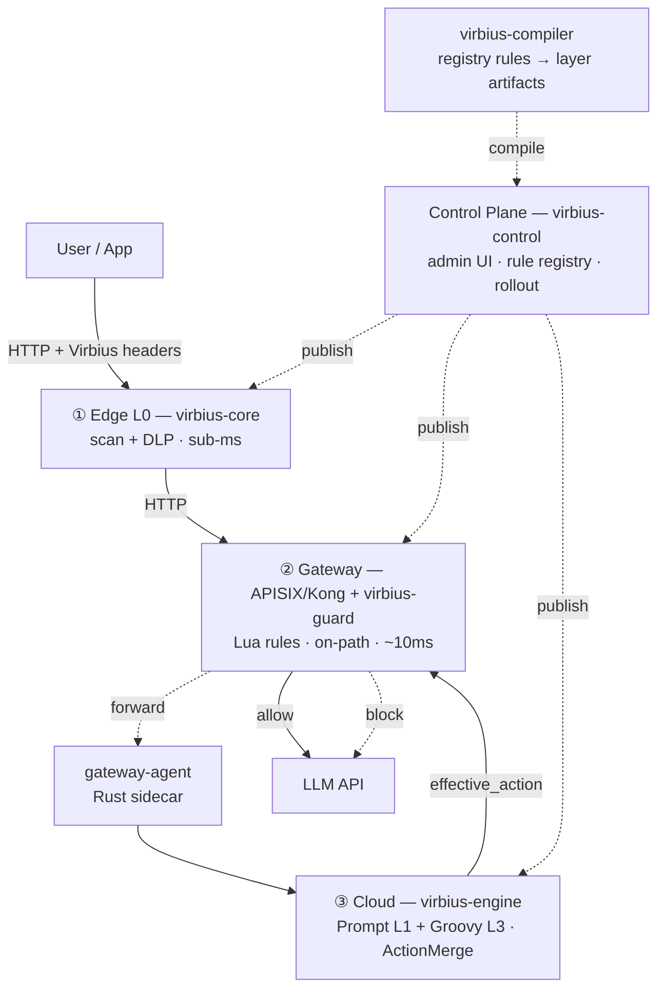

# VirbiusLLM

[](https://github.com/i1see1you/VirbiusLLM/actions/workflows/ci.yml)
[](LICENSE)
[](https://adoptium.net/)
[](https://www.rust-lang.org/)
中文：[README.zh.md](README.zh.md)

VirbiusLLM is a deep security protection platform specifically designed for Large Language Models (LLMs). It adopts a three-layer "edge–gateway–cloud" defense-in-depth architecture. By integrating fine-tuned safety LLMs with a dynamic policy engine, the platform achieves end-to-end closed-loop protection, spanning prompt injection interception, sensitive command filtering, and secondary content auditing.

The architecture is designed with reference to the security frameworks of Alibaba and Meituan，follows an **edge–gateway–cloud** model with a **unified control plane** and **layered enforcement**:



| Layer | Responsibility | Component |
|-------|---------------|-----------|
| **① Edge** | Local keyword / blacklist / DLP desensitization; synchronous, sub-ms. Can work offline. | `virbius-core` |
| **② Gateway** | On-path real-time firewall: static Lua rules, access lists, rate limiting. Forwards to engine on demand via sidecar. | `virbius-gateway` (APISIX/Kong plugins) + `virbius-gateway-agent` (Rust sidecar) |
| **③ Cloud** | Semantic detection (Prompt L1), Groovy policy (L3), multi-rule merge. Called selectively per risk level. | `virbius-engine` |

| Cross-cutting | Role | Component |
|---------------|------|-----------|
| **Control Plane** | Single source of truth for rules, rollout state, and admin UI. Publishes artifacts to all layers. | `virbius-control` |
| **Compiler** | Transforms registry rules into layer-specific artifacts (edge manifest, gateway JSON, engine input). | `virbius-compiler` |

Rules are versioned in **`rule_history` / `rule_revision`**. Publishing flows through **Compiler + PublishOrchestrator**: edge via CDN, gateway via etcd/file, engine via **Registry DB → RuleCache**.

**MVP scope (frozen):** edge L0 + **APISIX gateway (required)** + engine (L1 Prompt + Groovy); rollout modes `dry_run` / `canary` / `full`.

## Documentation

| Topic | Link |
|-------|------|
| System design | [docs/DESIGN.md](docs/DESIGN.md) |
| User guide (EN) | [docs/user-guide.en.md](docs/user-guide.en.md) |
| User guide (中文) | [docs/user-guide.md](docs/user-guide.md) |
| Seed data & admin API | [docs/seed-api.md](docs/seed-api.md) |
| Repo layout | [docs/repo-layout.md](docs/repo-layout.md) |
| Glossary | [docs/GLOSSARY.md](docs/GLOSSARY.md) |
| Release process | [docs/RELEASING.md](docs/RELEASING.md) |

## Requirements

- **JDK 17**, **Maven 3.9+**
- **Rust** (for `virbius-core` and `virbius-gateway-agent`)
- **Redis** (for audit ingest and cumulative counters; `run-local.sh` auto-starts it)
- Optional: **Ollama/vLLM** (for Prompt 1B rules on engine)
- Gateway: **APISIX** (MVP required) or **OpenResty** (stretch)

See [docs/repo-layout.md](docs/repo-layout.md) for environment details.

## Quick start

**Recommended: use `run-local.sh`** (builds and starts control + engine + gateway-agent; leverages `mvn` and `cargo` on `PATH`):

```bash
bash scripts/run-local.sh
```

**Manual start** (step by step):

```bash
# 1. Build
mvn clean install -DskipTests          # virbius-control + virbius-engine
cargo build --release                   # gateway-agent + virbius-core

# 2. Start locally (H2 in-memory, auto schema)
cd virbius-control
mvn spring-boot:run \
  -Dspring-boot.run.profiles=local

# 3. Smoke test
curl -s http://localhost:8080/api/v1/health
```

You may also set `MVN` env var to a specific Maven path before running `run-local.sh` if `mvn` is not on `PATH`.

## Edge SDK (`virbius-core`)

Rust clients can depend on the crate via path or git:

```toml
[dependencies]
virbius-core = { git = "https://github.com/i1see1you/VirbiusLLM" }
```

**Offline demo** (fixture manifest with DLP rules):

```bash
cd virbius-core
cargo run --example rust_client_demo
```

**Control sync (Scheme B+)** — after `bash scripts/run-local.sh` and publishing edge rules:

```bash
export VIRBIUS_CONTROL_BASE_URL=http://127.0.0.1:8080
export VIRBIUS_TENANT_ID=default
export VIRBIUS_APP_ID=beta
export VIRBIUS_EDGE_CACHE_DIR=./cache/beta
# optional when VIRBIUS_API_KEY_AUTH_ENABLED=true on control:
export VIRBIUS_EDGE_API_KEY=<your_api_key>
cargo run --example rust_client_demo
```

Production apps should use `VirbiusEdge::init(EdgeInitConfig { ... })` from app config, not env vars. See [docs/user-guide.en.md](docs/user-guide.en.md) §3.

Gateway HTTP example (requires APISIX PoC):

```bash
export VIRBIUS_GATEWAY_URL=http://127.0.0.1:9080/v1/chat/completions
cargo run --example gateway_http_client
```

More detail: [virbius-core/README.md](virbius-core/README.md) · [docs/user-guide.en.md](docs/user-guide.en.md).

## Gateway

VirbiusLLM supports two gateway backends:

| Backend | Status | Integration |
|---------|--------|-------------|
| **APISIX** | MVP (required) | `virbius-guard` plugin via shared Lua `lib/` |
| **OpenResty** | Stretch (supported) | Compiler-flattened `effective-*.json` + `access.lua` |

Both share the same Lua core (`virbius-gateway/lib/`) and runtime data (access lists, scene registry) written by `virbius-control`.

### APISIX

PoC route/service samples: [examples/gateway/poc-default/0.1.0/](examples/gateway/poc-default/0.1.0/).

Binding order: **Global → Service (tenant) → Route (scene)**. The `virbius-guard` plugin runs local access lists, then calls gateway-agent → engine.

### OpenResty

Compile-time flatten via `virbius-compiler`. The compiler merges bundle, scene registry, and access lists into `effective-*.json` consumed by `access.lua`.

```bash
./scripts/compile-openresty-poc.sh
```

- Nginx template: [examples/gateway/openresty-poc/0.1.0/](examples/gateway/openresty-poc/0.1.0/)
- Spec: [docs/openspec/openresty-gateway.md](docs/openspec/openresty-gateway.md)
- Integration: [virbius-gateway/README.md](virbius-gateway/README.md)

## Layer responsibilities

### ① Edge: lightweight interaction protection & behavior sensing

The edge is the first touch point between users and LLMs. It performs local filtering and behavior baseline collection without degrading user experience.

- **Risk control & behavior analysis**: collect typing cadence, device fingerprint, request sequences via lightweight probes. Flag script bots, credential stuffing, or abnormal traversal.
- **Challenge-response**: protocol validation and optional CAPTCHA against batch injection and DDoS.
- **Pre-compliance filtering**: local sensitive-word lists and regex for obvious policy violations, reducing noise sent upstream.

### ② Gateway: real-time semantic interception & protocol validation

The gateway is the real-time firewall on the request path, focusing on prompt injection, jailbreak, and DLP.

- **Bidirectional detection**: layered detection on both request and streaming response. Input side uses instruction restructuring to strip malicious intent while preserving legitimate business semantics. Output side intercepts bias, violence, hallucination, or non-compliant content.
- **DLP**: real-time PII/credit-card/code identification via regex and privacy computing. Mask, sanitize, or block per policy.
- **API governance**: access control, parameter tampering detection, rate limiting based on least-privilege principle.

**L1 vs L2**:

| | L1 | L2 |
|--|----|----|
| Means | Lightweight model, regex, signature rules | Semantic model, instruction restructuring |
| Target latency | < 50ms | Heavier, triggered on high-risk only |
| Scenario | Known jailbreak templates, obvious injection | Variant attacks, ambiguous prompts |

### ③ Cloud main path: global policy computation & disposition

The online decision center aggregates data from edge and gateway, computes risk scores, and issues dispositions.

- **Multi-dimensional correlation**: real-time fusion of edge behavior logs, gateway traffic logs, user profiles, and historical risk records.
- **Dynamic policy computation**: comprehensive risk scoring per session (including multi-turn jailbreak and topic drift). Supports tenant + scene + role 3D policy, adjustable thresholds.
- **Security auto-reply**: for high-sensitivity queries, return preset compliant responses without calling the LLM, ensuring safety while reducing latency.

### ④ Cloud async: intelligence evolution & model tuning

The async path operates out-of-band, driving long-cycle threat hunting and model iteration.

- **Feature collection**: full telemetry (including blocked samples and normal traffic) builds a security corpus for offline analysis.
- **ML & adversarial training**: continuous fine-tuning on attack datasets. Red-teaming simulations proactively surface logic and multi-turn vulnerabilities.
- **Model tuning & policy optimization**: quantifies false-positive and false-negative rates. Periodically pushes updated model parameters, threat signatures, and refined policies to gateway and edge, forming a detect–analyze–optimize–deploy closed loop.

## Rule runtimes

Each layer supports specific rule runtimes, compiled by `virbius-compiler` into layer-specific artifacts.

| Layer | Runtime | Body form | Applicable scenario |
|-------|---------|-----------|---------------------|
| **Edge** | `lua-dsl` | JSON (`list_type` + `keywords`) | **L0 local interception**: keyword / regex / user-device blacklist. Sub-millisecond, offline-capable. Blocked requests never reach the gateway. |
| | `dlp-dsl` | JSON (`entity_type` + `pattern` + `mask_template`) | **PII desensitization**: detects ID cards, phone numbers, emails, bank cards, etc., replaces with placeholders before sending to LLM, restores on response. Fixed `intent_action=allow`; does not participate in ActionMerge. |
| **Gateway** | `lua` | Executable Lua script (`function decide(ctx) ... end`) | **On-path real-time firewall**: access-list matching (`listMatch`), rate limiting (`getCumulative`), static content detection. P99 < 10ms. Blocked requests never call the LLM. |
| **Cloud** | `prompt` | Natural language description | **L1/L2 semantic detection**: 1B safety-model matrix identifies jailbreak, prompt injection, and sensitive semantics. |
| | `groovy` | Executable Groovy script (`def decide(ctx) { ... }`) | **L3 policy final decision**: merges signals from all layers, outputs `effective_action` (`deny` > `captcha` > `review` > `allow`). The sole terminal-decision layer. |

**Defense-in-depth progression**: L0 fail → no upstream; gateway static fail → no LLM call; cloud final decision → gateway executes disposition. Latency increases by layer: edge < 5ms → gateway < 10ms → cloud L3 < 30ms (excluding model inference).

**Recommended combinations**: mobile/desktop low-latency → Edge (±Gateway); web/API without SDK → Gateway (±Cloud); high-compliance → all three layers.

## Roadmap

### P0 — Core

| Item | Description |
|------|-------------|
| **MVP edge–gateway–cloud** | Edge L0 + APISIX + engine + control publishing; dry_run / canary / full. See [DESIGN §11.6](docs/DESIGN.md). |
| **Detection grading L0–L3** | L0 edge; L1/L2 cloud (RPC from gateway); L3 cloud policy. Gateway only executes static skills. |
| **Unified decision model** | All layers produce (risk_score + action); `ActionMerge` in `virbius-engine` consolidates instead of each layer acting independently. |
| **Skill lifecycle** | draft → publish → dry_run → canary → full. See [DESIGN.md](docs/DESIGN.md) and [seed-api.md](docs/seed-api.md). |
| **Fail policy table** | Per-tenant: financial systems fail-close, internal tools fail-open + async alert. |

### P1 — Differentiation

| Item | Description |
|------|-------------|
| **Session-level risk scoring** | Maintain session risk score across turns (multi-turn jailbreak, topic drift). |
| **Attack taxonomy** | Classify skills per MITRE-like categories (direct injection, indirect injection, jailbreak template, data exfiltration). |
| **Human-in-the-loop queue** | Gray zone (0.4–0.7 score) routed to manual review or secondary model. |
| **Business context binding** | Same prompt → different policy based on tenant + scene + role (general chat vs medical vs code assistant). |
| **Agent guardrails for skill generation** | Agent may only produce candidate rules + test cases; auto-regression required before merge. No direct push to production. |

### P2 — Long term

| Item | Description |
|------|-------------|
| **Lightweight security model** | Distilled classifier/NER model on gateway, reducing dependency on secondary LLM calls. |
| **Streaming output audit spec** | Chunk size, buffer window, hold-then-release for high-compliance scenarios. |
| **Adversarial sample ops** | Public benchmark (e.g. JailbreakBench) + in-house samples; weekly auto-regression. |
| **Explainability** | Show rule ID, similar samples, risk dimensions on block reasons for user/operator appeal. |
| **Supply chain** | Plugin signature, permission whitelist, invocation budget for third-party MCP/plugins. |

## System layer breakdown

Building on the "edge–gateway–cloud" architecture, the system can be further divided into five layers, each with distinct responsibilities, coordinated through L0–L3 detection grading and **`virbius-engine`**.

### Layer overview

| Layer | Path attribute | Typical latency | Blocks user request |
|-------|---------------|-----------------|---------------------|
| ① Edge SDK | Synchronous, local | Milliseconds | Yes (local logic only) |
| ② Gateway (L1–L2, SSE) | Synchronous, on-path | Tens to hundreds of ms | Yes |
| ③ Cloud main path (L3, tenant, policy) | Synchronous / nearline | Hundreds of ms | Optional (typically on-demand) |
| ④ Async pipeline | Asynchronous, side path | Seconds to hours | No |
| ⑤ ML inference | Called by ②/③ + offline training | Varies | Online inference blocks its layer; training does not |

**Request main path**: User input → Edge SDK (L0) → Gateway (static skills) → Cloud Scan (L1/L2) + Policy (L3) → LLM → Gateway SSE output audit → User. Side-path logs flow into the async pipeline throughout; model-based skills execute only on the cloud side and are deployed after offline iteration in the async pipeline.

### ① Edge SDK

**Characteristics**: Closest to the user; runs L0 keyword/regex and lightweight skill packages, capable of offline blocking; lightweight embedding into apps, web, or mini-programs; primarily focused on behavior collection and risk tagging.

**Role**:

- Intercept clearly violating content (political, adult, etc.), reducing invalid traffic to the gateway and LLM.
- Collect device fingerprints, typing cadence, request frequency, etc.; identify script bots, credential stuffing, and abnormal traversal; trigger CAPTCHA or elevate detection level for subsequent requests.
- Enforce protocol validation and challenge-response on anomalous traffic to block batch injection and crawlers.
- Pass `risk_tag`, rule hit context, and other signals to the gateway and cloud for unified policy evaluation.

**Boundary**: Does not perform complex semantic jailbreak detection; can be bypassed (via direct API calls) and must not serve as the sole defense line — requires coordination with the gateway.

### ② Gateway (L1–L2, SSE)

**Characteristics**: Mandatory hub for all LLM traffic; layered detection — L1 is lightweight classification/rules (low latency), L2 is semantic detection and instruction restructuring (triggered on demand); bidirectional audit on both input and streaming output; hosts real-time skills.

**Role**:

- Acts as a real-time firewall: intercepts or restructures requests before they reach the LLM; performs compliance review on responses leaving the LLM.
- Provides an OpenAI-compatible proxy for unified authentication, rate limiting, logging, and API governance.
- Executes DLP (phone numbers, ID cards, keys, etc. — mask or block).
- Executes allow, block, mask, or rewrite actions based on the decision returned by **virbius-engine**.

**L1 vs L2**:

| | L1 | L2 |
|--|----|----|
| Means | Lightweight model, regex, signature rules | Semantic model, instruction restructuring |
| Target latency | < 50ms | Heavier, triggered on high-risk only |
| Scenario | Known jailbreak templates, obvious injection | Variant attacks, ambiguous prompts |

**SSE streaming audit**: Inspect LLM streaming responses chunk by chunk; requires defined buffer window and whether to use hold-then-release (recommended for high-compliance scenarios); truncate or recall already-delivered content on violation (per policy configuration).

### ③ Cloud main path (L3, tenant, policy)

**Characteristics**: Online decision center; aggregates edge labels, gateway signals, user profiles, and historical risk data; supports tenant + scene + role 3D policies; **virbius-engine** (Groovy + Prompt) unifies the risk scores and actions from all layers to avoid redundant blocking.

**Role**:

- Comprehensive risk scoring (including session-level risk score, multi-turn jailbreak, and topic drift).
- Dynamic policy and fail-open / fail-close configuration per tenant.
- Disposition rendering: allow, block, alert, mask, or **security auto-reply** (return a preset compliant response without calling the LLM).
- Skill version management, canary ratio, rollback points; gray-zone samples pushed to the human-in-the-loop queue.
- Hosts nearline skills (allowing more complex logic than L1/L2).

**Relationship with the gateway**: The gateway handles fast-path execution; the cloud main path handles slower-path decision and configuration. Not every request needs to RPC to the cloud — it can be invoked on-demand based on risk labels to control latency.

### ④ Async pipeline

**Characteristics**: Side path, does not block the main request; collects logs and samples at full or sampled rate; runs long-cycle tasks (evaluation, red-teaming, reporting, release).

**Role**:

- Build a security corpus, mining long-tail attacks and novel adversarial samples.
- Drive the skill lifecycle: draft → sandbox evaluation → canary → full, version-bound to datasets.
- Agent generates candidate skills and test cases (must not push directly to production; regression required).
- Output attack taxonomy and false-positive / false-negative reports to support operations and red-teaming.
- Push optimized rules, vocabularies, and model parameters down to the gateway and edge, forming a detect–analyze–optimize–deploy closed loop.

**Difference from the cloud main path**: The cloud main path makes millisecond-to-hundred-millisecond decisions for the current request; the async pipeline drives continuous evolution of future rules and models, typically invisible to end users.

### ⑤ ML inference

**Characteristics**: Not an independent business layer; provides detection capabilities for layers ①–③ and is trained/updated in ④. Often deployed independently (ONNX Runtime, vLLM, Python Sidecar), decoupled from business processes. Models and evaluation datasets are versioned.

**Role**:

| Type | Description | Caller |
|------|-------------|--------|
| Lightweight classifier | Injection/jailbreak classification, topic violation | Cloud L1 (RPC from gateway) |
| Semantic / reconstruction model | Instruction restructuring, complex intent detection | Cloud L2 |
| Output audit model | Streaming chunk violation detection | Cloud (called by gateway SSE pipeline) |
| Embedding / similarity search | Explainability, similar attack samples | Cloud main path / async pipeline |
| Training & fine-tuning | Improve recall, reduce false positives | Async pipeline only |
| Third-party scanner | e.g. LlamaFirewall | Gateway sidecar |

**Relationship with skills**: Skills are human-readable rules that update quickly via hot-reload; ML handles variants and semantic ambiguity, updating more slowly but with stronger generalization. Production environments typically use a "rule first, model second" cascade.

### Layer mnemonics

| Layer | One-liner |
|-------|-----------|
| Edge SDK | Fast local blocking + behavior profiling, reduces upstream load |
| Gateway | Real-time shield on the traffic path, guards input and streaming output |
| Cloud main path | Tenant and policy brain, unified decision and auto-reply |
| Async pipeline | Side-path evolution: evaluation, canary, agent-generated rules |
| ML inference | Provides detection capability across layers: online inference, offline improvement |

## License

[MIT License](LICENSE) — Copyright (c) 2026 i1see1you.
