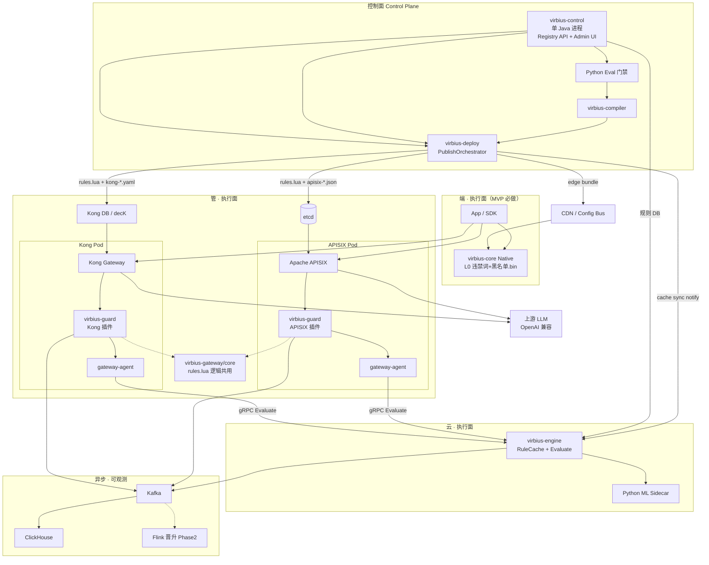
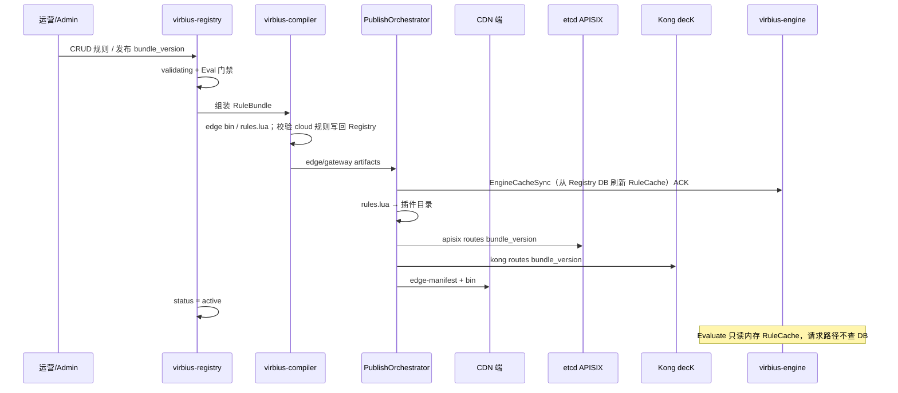
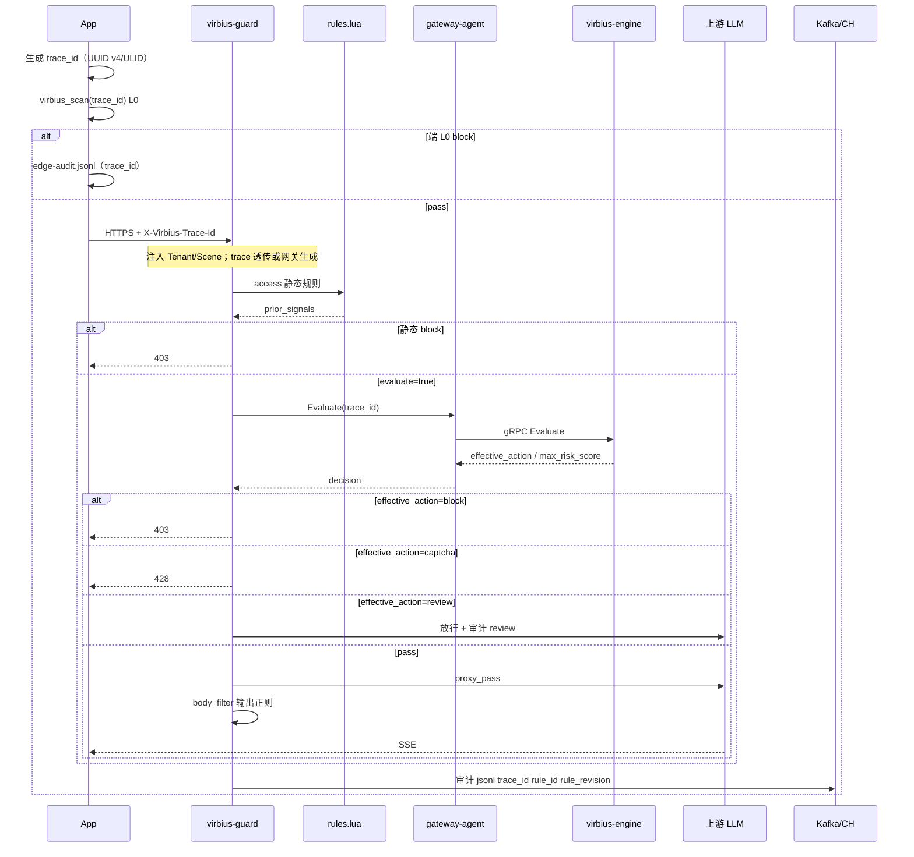
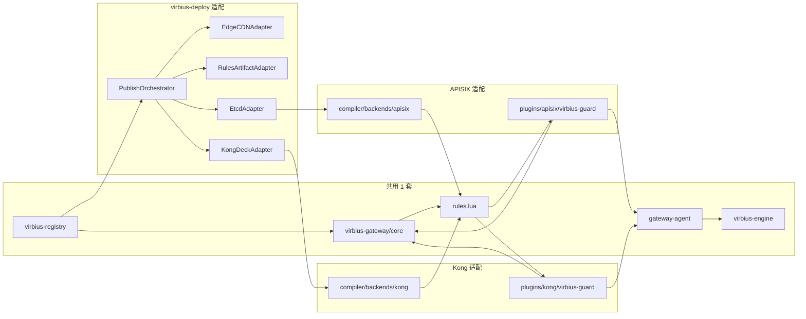
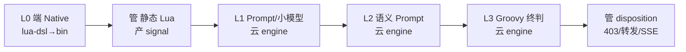

# VirbiusLLM 详细设计文档

| 项目 | 说明 |
|------|------|
| 文档版本 | v2.20 |
| OpenSpec | [docs/openspec/MVP-OPENSPEC.md](openspec/MVP-OPENSPEC.md)（MVP-1.11） |
| PoC 代码布局 | [docs/POC-REPO.md](POC-REPO.md) |
| 状态 | 草案 |
| 关联 | [README.md](../README.md) |

---

## 架构变更注记（2026-05 · intent_action）

自 MVP-1.10 起，以下语义**取代**文中仍出现的 `would_block` / 全量 `signals[]` / `rewrite|safe_reply` 表述：

| 概念 | 现行约定 |
|------|----------|
| 规则希望动作 | 表列 `intent_action`：`allow` \| `deny` \| `captcha` \| `review` |
| 对外响应 | `effective_action` 四值 + `max_risk_score`；**无** `signals[]` |
| dry_run 观测 | `effective_action=review`（非 `allow`+`would_block`） |
| 合并 | `ActionMerge` / `PolicyMerger`；优先级 deny > captcha > review > allow |
| HTTP | block→403，captcha→428，review/allow→200 |

权威细则：[openspec/rule-level-enforce.md](openspec/rule-level-enforce.md)（执行面）、[openspec/rule-rollout.md](openspec/rule-rollout.md)（运营放量）。

---

## 架构变更注记（2026-05 · rollout_state）

运营放量统一为 **`rollout_state` + `canary_percent`**（方案 A），替代 `rule_status` + `enforce_mode` 双字段：

| rollout_state | 含义 |
|---------------|------|
| draft / disabled | 不进执行面 |
| dry_run / canary / full | 进执行面；导出为 `enforce_mode` 供 ActionMerge |

**已定约束**（[rule-rollout.md §15](openspec/rule-rollout.md)）：

- 改 body → **强制 `draft`**，须重走 publish 流程  
- **`dry_run → full` 永久禁止**  
- dry_run→canary **门禁**与 **canary 阶梯**仅 **租户级**配置（不可 per-rule）  
- 审计 **AuditIngest**：默认 **Redis Stream**，可选 **Kafka**  

PoC 代码仍用 `rule_status` + `/status` + `/runtime`；R1 迁移。

---

本文档描述 VirbiusLLM 大模型安全防控平台的**总体架构、控制面与执行面分工、Skill 与策略引擎、端管云部署及关键流程**，作为实现与评审的基准。与 README 中的业务愿景、路线图（P0/P1/P2）保持一致，并固化近期架构决策。

---

## 2. 方案结论（是否还有问题）

整体方案**方向正确**，具备落地条件。需在设计与实现中**显式处理**以下项（非否定方案，而是工程约束）：

| # | 问题/风险 | 缓解措施（本文档已纳入） |
|---|-----------|-------------------------|
| 1 | README 早期表述将 L1/L2 放在网关；现决策为**管侧高性能、模型类 Skill 仅在云** | 检测分级逻辑不变；**物理执行**：L0 端，L1/L2 云检测服务，管侧静态 Skill + 执行处置 |
| 2 | 管侧每条请求 RPC 云检测，延迟与可用性压力 | 同机房 gRPC、合并 Scan+Policy 接口、静态规则前置过滤、scene 白名单跳过 |
| 3 | SSE 输出审计若走云模型，TTFT/体验受损 | 分 scene：`hold-then-release` vs 抽样审计 vs 管侧纯正则 |
| 4 | 端侧可被绕过（直连 API） | 管+云为必经；端为增强层 |
| 5 | L3 策略引擎选型 | **统一 `virbius-engine`（Groovy + Prompt）**，不使用 OPA/Rego |
| 6 | 异步/ML 语言未在「端 Rust + 管 Java + 云 Java」中写明 | 明确 **Python：检测推理、训练、Agent 评测** |
| 7 | 不支持 Web | 端侧**仅 Native**（Rust），不做 WASM |
| 8 | 规则脚本分散、双源 | **virbius-registry 为唯一规则真源**；Compiler 按层推送；部署产物禁止手改 |
| 9 | 云/管故障 Fail 策略 | 按 tenant 配置 fail-open/close + 管侧静态兜底 |

在上述约束落实后，**无需变更总体架构**，可进入分阶段实现。

---

## 3. 设计目标与非功能指标

### 3.1 目标

- 防御 prompt 越狱、敏感指令、间接注入、数据泄露及有害输出。
- **统一控制面**：安全编排与策略体系一套，端管云分层执行。
- **Registry 统一管规则、`virbius-engine` 统一执行与终判**：云侧执行 Prompt（L1/L2）与 Groovy（L3）。
- 支持 **tenant + scene + role** 三维策略与会话级风险。
- 可运营：版本、灰度、回滚、评测门禁、Agent 产草案。

### 3.2 非功能指标（初版建议）

| 指标 | 目标 |
|------|------|
| 端 L0 延迟 | P99 &lt; 5ms（本地） |
| 管静态 Skill | P99 &lt; 10ms |
| 管→云 `Evaluate`（L1/L2+L3） | 同 AZ P99 &lt; 80ms（含模型时另计） |
| 云 Engine Groovy 段（L3） | P99 &lt; 30ms（不含 Prompt 推理） |
| 管网关可用性 | 99.9%+；云检测失败走 Fail 策略 |
| Skill 灰度发布 | 租户×scene 维度，&lt; 30s 配置生效 |

---

## 4. 架构原则

1. **统一控制面 + 分层执行面**：编排、Skill、Policy 一处管理；端/管/云按层执行。
2. **Fail-fast**：L0 未过不上行；管静态未过不调 LLM；云决策 block 则管立即处置连接。
3. **单一终判**：**`virbius-engine`**（Groovy）合并各层 `signal` 与 Registry，避免管/端各自终判。
4. **模型 Skill 仅在云**：管（APISIX）不加载模型，仅转发与执行。
5. **Registry 规则真源**：规则内容由 Registry 统一管理；Lua/Groovy/Prompt 均为编译产物下发各层，禁止生产手写漂移（§8.9）。
6. **连接持有者优先处置**：云出决策，**管（APISIX）写响应**，非「回管复检」。

---

## 5. 总体架构

### 5.1 逻辑视图

```text
                    ┌─────────────────────────────────────────┐
                    │     安全编排与策略平台（控制面）          │
                    │  Skill 仓库 │ 编译器 │ 发布 │ Registry │ 运营台 │
                    └────────────────────┬────────────────────┘
                                         │ bundle + engine RuleCache 同步
           ┌─────────────────────────────┼─────────────────────────────┐
           ▼                             ▼                             ▼
    ┌──────────────┐            ┌──────────────┐            ┌──────────────┐
    │ 端 · 执行面   │            │ 管 · 执行面   │            │ 云 · 执行面   │
    │ Rust Native  │            │ APISIX+Lua   │            │virbius-engine│
    │ L0           │            │ 静态 Skill   │            │Prompt+Groovy │
    │              │            │ SSE 代理     │            │ L1–L3 统一   │
    └──────┬───────┘            └──────┬───────┘            └──────┬───────┘
           │                           │                           │
           └───────────────────────────┴───────────────────────────┘
                                         │
                                         ▼
                                  大模型（OpenAI 兼容）
```

### 5.2 与五层关系

| 逻辑五层 | 控制面 | 执行面 |
|----------|--------|--------|
| 端侧 SDK | Registry 发布 edge bundle | Rust Native L0 |
| 网关 | Registry 发布 gateway bundle | APISIX / Kong + `rules.lua` |
| 云主链路 | Registry `rule_history`（cloud 段） | **`virbius-engine`**（Java + Python ML） |
| 异步链路 | 评测/灰度编排 | Java 调度 + **Python** worker |
| ML 推理 | 并入 engine / worker | **Python** ONNX/vLLM |

### 5.3 整体技术架构图（v2.0）

#### 5.3.1 端-管-云 + 控制面 / 数据面



#### 5.3.2 规则发布与分层同步（Registry 真源）



#### 5.3.3 请求数据路径（以 APISIX 为例，Kong 同构）



#### 5.3.4 APISIX / Kong 适配边界（工作量最小化）



#### 5.3.5 检测分级 L0–L3 在架构中的位置



---

## 6. 检测分级 L0–L3 与端管云映射

| 级别 | 逻辑职责 | 执行位置 | Skill `runtimes` |
|------|----------|----------|------------------|
| **L0** | 词库、正则、明显违规 | **端** Native | `edge` |
| **L1** | 轻量分类、签名规则 | **云** 检测服务（管 RPC 调用） | `cloud` |
| **L2** | 语义判别、指令重构 | **云** Prompt + LLM/ONNX | `cloud` |
| **L3** | 策略合并、三维策略、代答 | **云** `virbius-engine` Groovy 引擎 | `cloud` + `runtime: groovy` |

**管层**：不承载 L1/L2 模型；执行 `gateway` 静态 Skill，并 **gRPC 调用 `virbius-engine.Evaluate`**（一次返回检测 signal + 最终 decision），根据结果 **disposition**。

**输出 SSE**：管层持有连接；审计策略由 Skill/Policy 配置（纯正则 / 缓冲送云 / hold-then-release）。

---

## 7. 统一控制面：安全编排与策略平台

### 7.1 模块

| 模块 | 技术建议 | 职责 |
|------|----------|------|
| **virbius-control** | Java + PostgreSQL/MinIO + 静态运营台 | **单进程控制面**：Registry API（规则真源）+ Admin 运营台（`ops.html`）；对外 **一套 HTTP**（§7.1.1） |
| Skill Compiler | Rust（edge）+ Java/CLI（gateway/cloud） | 从 Registry 组装 RuleBundle → 按 `layer`+`runtime` 编译并推送各层产物 |
| **virbius-engine** | Java + Python（Prompt/ML）+ **Groovy 沙箱** | 云侧统一：L1/L2 Prompt + L3 终判 |
| Release Orchestrator | Java + Temporal/XXL-JOB | 沙箱→灰度→全量 |
| Eval Service | **Python** | 数据集回归、误报漏报 |
| Agent Pipeline | **Python** LangGraph | 产 Skill 草案 + 测试用例 |
| Config Bus | Nacos / etcd | 管侧 APISIX、端侧 edge bundle 指针 |
| **virbius-deploy** | Java 库 / CLI（可嵌入 control） | **PublishOrchestrator** + 分层 **PublisherAdapter**（§8.10.6）；发布状态机（§8.9） |

#### 7.1.1 控制面部署：`virbius-control`（Registry + Admin 合一）

MVP 将原 **virbius-registry** 与 **virbius-admin** 合并为 **一个 Java 进程** `virbius-control`（模块化单体，非两个微服务）。

| 维度 | 约定 |
|------|------|
| **部署单元** | 单个 Spring Boot 应用；Maven/Gradle 子模块示例：`registry-core`、`admin-ui`（静态资源）、`deploy-orchestrator`（可选同进程） |
| **对外 HTTP** | **单一监听端口**（PoC `:8080`）；**单一 OpenAPI**：[registry.openapi.yaml](openspec/registry.openapi.yaml) |
| **路径** | `/api/v1/*` — 规则、Bundle、发布、enforce（compiler / deploy / 自动化均调用此面）；`/ui` → **`ops.html`** 静态运营台；`/health`、`/ready` — 探活 |
| **真源** | **仅 `registry-core` 写 PostgreSQL/MinIO**；Admin 为 UI + 鉴权 + 进程内调用 Registry Service，**不得**维护第二套规则存储或独立 BFF 真源 |
| **调用方** | 运营浏览器、virbius-compiler、`PublishOrchestrator`、未来 Agent → **同一基址** `http://virbius-control:8080` |
| **K8s** | Deployment/Service 名 **`virbius-control`**（1 副本 PoC）；**不**再单独部署 `virbius-admin:8081` |
| **Post-MVP** | 若拆分为多 Pod，仍保持 `/api/v1` 契约与「Registry 唯一真源」不变 |

```text
┌─ virbius-control (:8080) ─────────────────────────────┐
│  /api/v1/*     → registry-core（CRUD、发布、rule_history）│
│  /ui/*         → admin-ui（ops.html，调同进程 /api/v1/admin） │
│  PublishOrchestrator（库，发布编排，进程内触发）          │
└───────────────────────────────────────────────────────┘
```

### 7.2 Skill 与 virbius-engine 分工

| 职责 | 实现 |
|------|------|
| 规则定义、版本、审批 | **virbius-control / registry-core**（唯一真源）；可选导出 YAML/JSON 快照 |
| 编译与分层同步 | **Compiler + PublishOrchestrator** → 端 CDN / 管 etcd；云 **EngineCacheSync**（DB→RuleCache） |
| 检测与终判执行 | 端/管本地执行；云 **virbius-engine** `Evaluate` |
| 规则运行时状态（dry_run/canary/full） | `rule_history` 新 revision → engine **RuleCache** 刷新 |
| L1/L2 模型与 Prompt 推理 | **virbius-engine**（`runtime: prompt`） |
| L3 多信号合并、Fail、灰区、effective 处置 | **virbius-engine**（`runtime: groovy`，**不用 Rego**） |
| 审批、发布、Flink 晋升 | Java 编排（**virbius-control** / worker） |

详见 **§8**、**§7.3**、**§8.8**、**§8.9**。

### 7.3 virbius-engine（统一规则引擎服务）

**定位**：云侧**唯一**在线安全决策服务，合并原 `virbius-scan` + `virbius-policy`（OPA）职责。

```text
APISIX ──gRPC Evaluate──► virbius-engine
                              ├─ Prompt Runner   (L1/L2, runtime=prompt)
                              ├─ Groovy Engine   (L3, runtime=groovy)
                              ├─ RuleCache       (Registry DB 同步, enforce_mode)
                              └─ ML Runtime      (Python: ONNX / vLLM, 可选进程内或 sidecar)
```

| 模块 | 输入 | 输出 |
|------|------|------|
| **Prompt Runner** | **RuleCache** 中 prompt 规则, 正文, tenant/scene | `Signal`（model 命中） |
| **Groovy Engine** | **RuleCache** 中 groovy + enforce_mode, 全部 signal | `EngineDecision`（effective_action） |
| **RuleCache** | Registry DB 发布时同步 | 全量/增量刷新；Evaluate 只读缓存 |

**对外接口**：单一 gRPC `Evaluate`（见 §11.2），管层**一次调用**完成检测 + 终判。

**技术栈**：**Java 17**（宿主、Groovy 沙箱、gRPC；PoC 与 `pom.xml` `java.version` 对齐）；Python FastAPI（大模型 Prompt / ONNX，同集群或 sidecar）。**执行安全**：§14.1–§14.2（F-12）。

**L3 不用 OPA 的原因与替代**：Rego 与 manifest 中 **Groovy** 重复；统一 Groovy 可读取 `enforce_mode`、合并 signal、实现 dry_run/canary，与 Prompt 同一进程，降低管云 RPC 次数。

---

## 8. Skill 体系

### 8.1 设计原则

| 原则 | 说明 |
|------|------|
| **Registry 唯一真源** | 规则正文、scope、`intent_action` 由 **virbius-registry** 维护；运营经 Admin/API 写入，**不以人手维护 `manifest.yaml` 为真源** |
| **Bundle 版本单元** | 每次发布对应 `bundle_id` + `bundle_version`；全链路（端/管/云）对齐同一版本号 |
| **规则执行形态** | `runtime`: **`lua-dsl`**（端）、**`lua`**（管）、**`native`** / **`prompt`** / **`groovy`**（云）；见 §8.5.0 |
| **按层推送，非跨语言编译** | 不从 Lua「编译成」Groovy；Compiler **按 `layer` 抽出 `body` 并校验**，PublishOrchestrator 经 Adapter 推送至各执行面 |
| **内容与运行时分离** | 均记入 **`rule_history`** 不同 `rule_revision`（正文变更或仅 enforce 变更，§8.5.1） |
| **统一≠单进程** | **控制面**（Registry + Compiler + PublishOrchestrator）负责管理与同步；**virbius-engine** 为数据面执行与终判，不在请求路径分发全量规则 |

### 8.2 逻辑结构：RuleBundle（Registry 存储）

Registry 按租户存储规则；**规则正文与运行时状态的真源版本**为 **`rule_history`（按 `rule_revision` 追加）**；`bundles` / `bundle_version` 仅用于**发布批次**与端管云对齐，**不要求**写入拦截审计日志。

```text
registry DB / 对象存储
├── bundles(id, tenant, version, status, publish_id, created_at)   # 发布批次元数据
├── rules_current(rule_id, tenant_id, current_revision, ...)      # 当前指针（可选，便于 Admin 列表）
├── rule_history(                                                  # ★ 真源版本（追加写）
│     rule_id, rule_revision, tenant_id, bundle_id,
│     layer, runtime, reason_code, intent_action, scope,
│     body, body_hash,
│     enforce_mode, canary_percent,
│     effective_from, effective_to, modified_at, modified_by, publish_id
│   )
└── bundle_prompts(bundle_id, prompt_id, system, ...)             # 可选
```

**改规则 / 改 enforce**：`INSERT` 新 `rule_revision`（`revision` 单调递增），上一条 `effective_to = now()`；**禁止**原地覆盖历史行。

**可选导出**（Git 镜像 / 灾备，**非真源**）：

```text
export/{tenant}/{bundle_id}/{version}/bundle.yaml   # 或 bundle.json
```

**规模建议**：单 Bundle 规则 &lt; 50 条、Prompt 总长 &lt; 数百 KB；超出可将大段 `prompt` 存对象存储并由 `bodyRef` 引用（Phase 2）。

### 8.3 规则形态与层级映射

| `layer` | `runtime` | `body` 内容 | 推送产物 | 执行面 |
|---------|-----------|-------------|----------|--------|
| **edge** | `lua-dsl` | 违禁词表、正则、**黑名单**表（Lua 表语法） | `dict.bin`, `regex.bin`, `blacklist.bin`, `edge-manifest.json` | **Rust Native**（**不**下发 .lua） |
| **gateway** | `lua` | APISIX 检测逻辑 | `rules.lua`, `apisix-routes.json` | OpenResty / APISIX |
| **cloud** | `native` | keyword / 逻辑变量名单（`vars`） | **Registry DB** → **RuleCache** | **virbius-engine** 内置 Runner |
| **cloud** | `prompt` | 模型 system/user 模板 | 同上 | **virbius-engine** Prompt Runner |
| **cloud** | `groovy` | **L3 策略与终判**（读 `enforce_mode`） | 同上 | **virbius-engine** Groovy 沙箱 |

| 禁止 | 说明 |
|------|------|
| 端侧下发可执行 `.lua` | App 仅加载编译后的 **二进制** |
| `layer=gateway` + `runtime=prompt` | 模型类仅在 **cloud** |
| 手写 etcd 上的 `rules.lua` | 必须由 Registry 发布流水线编译推送 |
| 请求路径向 Registry/DB 拉全量规则 | **禁止**；engine 仅在**发布/变更时**从 Registry 同步 **RuleCache**，Evaluate 只读缓存 |

### 8.4 RuleBundle 结构示例（可选导出为 manifest.yaml）

```yaml
apiVersion: virbius.io/v1
kind: SkillBundle
metadata:
  id: acme-pack
  version: "2.3.1"
  tenant: acme-corp
  mitre_tags: [jailbreak_template]

publish:
  dataset_ref: eval-v4
  lifecycle_intent: prod   # 发布意图；非线上 enforce 真相

bundle:
  gateway:
    cloud_scan:
      endpoint: grpc://virbius-engine:50051
      timeout_ms: 80
  prompts:                 # 可选：多条规则共用的 Prompt 模板
    inject-v2:
      system: "你是注入检测器，只输出 JSON。"

rules:
  - id: E1
    reason_code: EDGE-POL-01
    layer: edge
    runtime: lua-dsl
    intent_action: block
    scope:
      scenes: ["*"]
      roles: [user]
    body: |
      words = { "违禁A", "违禁B" }
      regex = { "(?i)敏感词" }

  - id: G1
    reason_code: GW-JB-010
    layer: gateway
    runtime: lua
    intent_action: block
    scope:
      scenes: [general_chat]
      roles: [user]
    body: |
      -- 检测：返回 signal；终判由 virbius-engine（Groovy L3）决定
      local m = ngx.re.match(body, "(?i)DAN\\s+mode")
      if m then
        return virbius.signal("G1", rule_revision, 0.95, "block")
      end

  - id: C1
    reason_code: CL-MODEL-INJECT
    layer: cloud
    runtime: prompt
    intent_action: block
    scope:
      scenes: [general_chat]
      roles: [user]
    body:
      ref: inject-v2
      user_template: "{{content}}"
      threshold: 0.85
      model: prompt-guard-v2

  - id: C2
    reason_code: CL-POL-GRAY-MED
    layer: cloud
    runtime: groovy
    intent_action: review
    scope:
      scenes: [medical_qa]
    body: |
      // L3 终判逻辑（示例）：合并 signal、enforce_mode、tenant Fail
      def decide(ctx) {
        if (ctx.enforceMode('C2') == 'dry_run') return ctx.wouldBlock('block')
        if (ctx.scene == 'medical_qa' && ctx.maxScore >= 0.4 && ctx.maxScore < 0.7)
          return [action: 'review']
        if (ctx.maxScore >= 0.85 && ctx.failMode == 'fail_close') return [action: 'block']
        return [action: 'allow']
      }
```

### 8.5 规则条目字段

| 字段 | 必填 | 说明 |
|------|------|------|
| `id` | ✅ | 对应 **`rule_id`**；**租户内唯一**（与 `tenant_id` 联合唯一，§11.6.0） |
| `reason_code` | ✅ | 申诉、报表 |
| `layer` | ✅ | `edge` \| `gateway` \| `cloud` |
| `runtime` | ✅ | `lua-dsl` \| `lua` \| `native` \| `prompt` \| `groovy`（见 §8.5.0） |
| `intent_action` | ✅ | allow / deny / captcha / review |
| `scope` | ✅ | `tenants`, `scenes`, `roles` |
| `body` | ✅ | 多行字符串（`\|`）或 Prompt 对象 |
| `body.ref` | 可选 | 引用顶层 `bundle.prompts` |

**版本与运行时（写入 `rule_history`，非 Bundle 正文字段）**：

| 字段 | 说明 |
|------|------|
| **`rule_revision`** | 该 `rule_id` 下单调递增整数（或 ULID）；**拦截审计必带** |
| **`rollout_state`** | **R1+ 运营真源**：`draft` \| `disabled` \| `dry_run` \| `canary` \| `full`（[rule-rollout.md](openspec/rule-rollout.md)） |
| `rule_status` | **PoC 过渡**；R1 删除 |
| `enforce_mode` | **执行面导出**（PoC 列名）：`dry_run` \| `canary` \| `full`；由 `rollout_state` 映射 |
| `canary_percent` | `canary` 时必填（1–100） |
| `modified_at` / `modified_by` | 变更时间与操作者 |
| `effective_from` / `effective_to` | 生效区间；按 `intercepted_at` 可还原当时规则 |

**改 body**：`dry_run|canary|full` 下变更 → **强制 `rollout_state=draft`**（rule-rollout §3.4）。

**`bundle_id` / `bundle_version`**：仅关联发布批次（`publish_id`）；**拦截日志不记录**（见 §13.1）。

#### 8.5.0 `runtime`、放量与执行面 `enforce_mode`

> **运营放量**见 [rule-rollout.md](openspec/rule-rollout.md)（`rollout_state`）；本节 **`enforce_mode`** 为执行面语义（ActionMerge）。

**`runtime`**：声明规则由哪类执行器加载/执行；与 **`layer`** 组合使用（运营台新建规则时按层限制可选值）。

| `runtime` | 典型 `layer` | 执行位置 | 职责 | `body` 形态（PoC） |
|-----------|--------------|----------|------|-------------------|
| **`lua-dsl`** | edge | 端 Native | L0 词库/正则，编译为 bin | 表 DSL / keywords |
| **`lua`** | gateway | APISIX + 名单 JSON | 主体/网络/内容/逻辑变量名单 | keywords、subjects、`vars` 列表等 |
| **`native`** | cloud | virbius-engine 内置 | L1 名单：keyword、逻辑变量（`vars`） | JSON：`keywords` 或 `vars` + `list_type` |
| **`prompt`** | cloud | virbius-engine Prompt | L1/L2 模型/Prompt 检测 | Prompt 文本或模板 |
| **`groovy`** | cloud | virbius-engine Groovy | L3 终判：合并 signal、`enforce_mode` | `def decide(ctx) { ... }` 脚本 |
| **`cumulative`** | gateway / cloud | **CounterStore**（Redis） | `getCumulate(value, name)` → ctx | `cumulative_name`；可选 `value_source` |
| **`list_match`** | gateway / cloud | **ListStore**（名单快照） | `matchList(value, name)` → ctx | `list_name`；可选 `value_source` |

名单同步生成的规则（如 `gw_*`、`cloud_l1_*`）多为 **`lua`（管）** 或 **`native`（云）**（**待迁移**至 `list_match`）；自定义策略选 **`prompt` / `groovy`**。名单/累计见 **§8.5.0.1–2** 与 [openspec/](openspec/)（**PoC 待实现**）。

**`enforce_mode`**：写入 `rule_history`，主要约束 **云侧 L3（`runtime=groovy`）** 在已命中时是真拦截还是观测；与 `intent_action`（规则希望动作）、`effective_action`（本次实际动作）分离（§8.8.3）。

| `enforce_mode` | 典型作用范围 | 行为（各层 ActionMerge / Groovy L3） |
|----------------|--------------|--------------------------------------|
| **`dry_run`** | 管 + 云 | 命中 deny/captcha 意图 → 对外 **`effective_action=review`** |
| **`canary`** | 管 + 云 | 桶内真 `block`/`captcha`；桶外 `review` |
| **`full`** | 管 + 云 | 命中即真 `block`/`captcha` |
| ~~`disabled`~~ | — | **已移除**；逻辑删除改用 **`rule_status=disabled`**（不进产物） |

管/端规则行上可有 `enforce_mode` 字段（PoC 多为 `dry_run` 占位）；**网关名单命中仍直接 403**，不读 Groovy enforce（§8.8.3 禁止管侧在 dry_run 下绕过 engine 真拦的逻辑由架构保证）。**仅改 enforce** 时追加 `rule_history` revision 并 **EngineCacheSync**，无需重编译 gateway/edge 产物（§8.8.2）。

运营台：http://127.0.0.1:8080/ui → 左侧导航「规则」（云/管/端）与「**策略上线**」（`rollout_state` 放量；见 [rule-rollout.md](openspec/rule-rollout.md) §8.3）。契约：**Admin API** 以 [registry.openapi.yaml](openspec/registry.openapi.yaml)（`/api/v1/admin/...`）为准；gateway-agent `vars` 优先语义见同目录 [gateway-agent.openapi.yaml](openspec/gateway-agent.openapi.yaml)。

#### 8.5.0.1 累计规则（CounterStore）

**状态**：设计冻结，**PoC 代码尚未实现**。详见 **[openspec/cumulative-counter.md](openspec/cumulative-counter.md)**。

| 项 | 约定 |
|----|------|
| 定义真源 | **`tb_cumulative`**，主键 `(tenant_id, cumulative_name)`；窗口/阈值/reason 在定义行 |
| 数值 | **Redis** 1/10 分钟桶；无 `calendar_week` |
| 规则 body | 必填 `cumulative_name`；可选 **`value_source`**（不写则用定义 `dimension` 解析请求 value） |
| 平台接口 | `getCumulate(value, cumulativeName)` → **`ctx.cumulative()`** → 规则引擎 / Groovy |
| 读写 | 管侧 **Ingest**；管/云 **Read**；Groovy **不**直连 Redis |
| Redis Key | `virbius:cum:{tenant}:{name}:{value}` |

#### 8.5.0.2 名单规则（ListStore）

**状态**：设计冻结，**PoC 代码尚未实现**。详见 **[openspec/list-match.md](openspec/list-match.md)**。

| 项 | 约定 |
|----|------|
| 定义真源 | **`list_name`** + 元数据（`polarity`、`dimension`）+ **条目**（静态 value 集合） |
| 规则 body | 必填 `list_name`；可选 **`value_source`**（不写则用定义 `dimension` 从请求取 value） |
| 平台接口 | `matchList(value, listName)` → **`ctx.list()`** → 规则引擎 / Groovy |
| 产物 | 名单快照 JSON；**无**固定 12 `rule_id` 投影 |

**value 解析（共有）**：[openspec/value-resolution.md](openspec/value-resolution.md) — 规则可不配 `value_source`（默认）；配了则覆盖定义的 `dimension`。**名单 entries** = 要比对的黑/白名单；**请求 value** = 每次请求解析出的候选值。

**合并设计（推荐阅读）**：[openspec/list-and-cumulative-rules.md](openspec/list-and-cumulative-rules.md)。

#### 8.5.1 规则历史表与还原

```text
拦截时刻 (rule_id, rule_revision)
    → SELECT * FROM rule_history
        WHERE rule_id = ? AND rule_revision = ?
    → 得到当时 body、enforce_mode、reason_code（无需 bundle_version）

仅 (rule_id, intercepted_at) 时：
    → WHERE rule_id = ? AND effective_from <= t AND (effective_to IS NULL OR effective_to > t)
    → 取一条；发布并发时优先日志中的 rule_revision
```

| 执行面 | `rule_revision` 来源 |
|--------|----------------------|
| edge | compiler 写入 `dict.bin` / `blacklist.bin` 命中元数据 |
| gateway | `virbius.signal(rule_id, rule_revision, …)` |
| cloud | Prompt/Groovy 命中或 `EvaluateResponse` 带出 |

#### 8.5.2 术语：`rule_history`（禁止 `rule_runtime` 作真源）

| 术语 | 含义 |
|------|------|
| **`rule_history`** | ★ **唯一版本真源**（追加写）：`body`、`enforce_mode`、`canary_percent` 等均在**新 `rule_revision`** 行体现 |
| **`rules_current`** | 可选指针表：`rule_id` → 当前 `rule_revision`（便于 Admin 列表） |
| **`RuleCache`** | engine **内存物化**，发布/`runtime_only` 时从 `rule_history` 刷新；**非**真源 |
| ~~`rule_runtime`~~ | **废弃表名**；历史文档若出现，一律理解为 **`rule_history` 中含 enforce 字段的 revision** |

### 8.6 统一编排：Registry 发布 → 按层编译 → 分层同步

```text
Admin / Agent API → virbius-registry（draft）
    ↓  Schema 校验 + 静态扫描 + Eval 门禁（Python）
publish(bundle_version) → status: compiling
    ↓
virbius-compiler（从 Registry 组装 RuleBundle）
    ├─ layer=edge,  runtime=lua-dsl  → dict.bin + edge-manifest.json
    ├─ layer=gateway, runtime=lua    → rules.lua + apisix-*.json / kong-*.yaml
    └─ layer=cloud,  runtime=native/prompt/groovy → 校验写回 Registry；engine RuleCache 发布时加载（**不**推 CDN/etcd 规则文件）
    ↓ 签名
virbius-deploy / PublishOrchestrator → syncing
    ├─ CDN（端）
    ├─ etcd + rules.lua（管）
    └─ EngineCacheSync：通知 engine 从 Registry DB 刷新 RuleCache（云）
    ↓ 各层 ACK 成功
status: active；更新 Config Bus 指针与路由 bundle_version
    ↓（可与内容发布解耦）
`rule_history` **仅 enforce 变更**（新 `rule_revision`）→ **EngineCacheSync（runtime_only）** 刷新 RuleCache（无需 edge/gateway 重推）
```

| 步骤 | 负责模块 |
|------|----------|
| 规则 CRUD / draft | Admin、Agent → **Registry API** |
| 发布前评测 | Python Eval（绑定 `dataset_ref`） |
| 编译 | **virbius-compiler**（读 Registry，不写 Git 真源） |
| 分层推送 | **PublishOrchestrator**（§8.10.6）；禁止手改 etcd/CDN |
| enforce 晋升 | `rollout_state`：`dry_run → canary → full`（**禁止** dry_run→full）；租户门禁/阶梯见 rule-rollout；可**不重编译**正文 |

### 8.7 编译产物一览

| 目标 | 产物 | 来源 |
|------|------|------|
| edge | `dict.bin`, `regex.bin`, `blacklist.bin`, `edge-manifest.json` | `lua-dsl` **编译**（非解释执行） |
| gateway | `rules.lua`, `apisix-routes.json` | 拼接各 `gateway`+`lua` 的 `body` + 统一框架 |
| cloud | （无对外文件制品） | Compiler **校验** `native`/`prompt`/`groovy`；写入 **`rule_history`**；engine **RuleCache** 发布时加载 |
| engine | 内存 **RuleCache** | 自 **`rule_history`** 物化（cloud 规则当前 revision + `enforce_mode`）；**非** CDN/etcd 文件下发 |

### 8.8 控制面与数据面分工

**原则**：**Registry** = 规则唯一真源（内容 + 版本 + 运行时状态）；**Compiler + PublishOrchestrator** = 发布时同步端管云；**virbius-engine** = 云侧执行 Prompt/Groovy 并产出 **effective 处置**（不参与请求路径规则分发）。**不使用 OPA/Rego**。

#### 8.8.1 分工总表

| 组件 | 平面 | 职责 |
|------|------|------|
| **virbius-control**（registry-core） | 控制面 | 规则 CRUD、`bundle_version`、审批、Eval 门禁触发；Admin UI 同进程 |
| **virbius-compiler** | 控制面 | 从 Registry 读 RuleBundle → 按 layer 编译产物 |
| **virbius-deploy** | 控制面 | **PublishOrchestrator** 编排各层 Adapter；发布状态机（§8.9、§8.10.6） |
| **virbius-engine** | 数据面 | **RuleCache**（发布时从 Registry DB 同步）；`Evaluate` 只读缓存 |
| 端 / 管执行面 | 数据面 | 加载**已发布** bin / `rules.lua`；本地执行，不调 Registry |

#### 8.8.2 Bundle 内容 vs 运行时状态

| 数据 | 存储 | 变更时是否重编译 / 全量同步 |
|------|------|---------------------------|
| `rules[].body`, `intent_action`, `scope` | `rule_history` 新 revision | ✅ 发布 → Compiler → 各层 artifact |
| `enforce_mode`, `canary_percent` | `rule_history` 新 revision | ❌ 仅 EngineCacheSync（runtime）；不推 edge/gateway 文件 |
| `bundle.cloud_scan` 等路由/超时配置 | `bundle_metadata` | 随内容发布或独立配置版本 |

#### 8.8.3 意图处置 vs 生效处置

| 字段 | 来源 | 含义 |
|------|------|------|
| `intent_action` | Registry `rules[]` | 规则命中后**希望**的动作 |
| `enforce_mode` | **`rule_history` 当前 revision** | `dry_run` \| `canary` \| `full` \| `disabled` |
| `effective_action` | **virbius-engine** Groovy 输出 | **本次请求**实际动作 |

| 场景 | intent | enforce | effective |
|------|--------|---------|-----------|
| 正常上线 | block | full | **block** |
| dry_run 观察 | deny | dry_run | **`review`** + `max_risk_score` |
| canary 5% | block | canary@5% | 5% block，其余 allow |
| L3 灰区策略 | block | full | **review**（Groovy 覆盖） |
| tenant Fail-open | block | full | **allow**（租户级） |

**禁止**：规则无 `intent_action`；或 gateway Lua 在 dry_run 下直接 `ngx.exit(403)` 绕过 engine。

#### 8.8.4 运行时状态同步（engine RuleCache，可与内容发布解耦）

```text
Registry 追加 `rule_history`（仅 `enforce_mode` / `canary_percent` 变更）
        ↓
POST .../runtime/publish-snapshot 或 EngineCacheSyncAdapter（runtime_only）
        ↓
virbius-engine 从 Registry DB 刷新 RuleCache 中 runtime 视图（毫秒级）
        ↓
Evaluate：Groovy 读 enforce_mode；dry_run → `action: review`
        ↓
APISIX 按 effective_action 处置；Kafka → Flink
```

**与端/管差异**：edge/gateway 必须**文件/路由推送**（分布式、异构运行时）；engine 集群集中，**RuleCache ← Registry DB** 即可，**不**生成 `prompts/*.yaml` / `engine-policy-snapshot.json` 挂载产物。

#### 8.8.5 rule_history 修订示例

```json
{
  "rule_id": "G1",
  "rule_revision": 7,
  "enforce_mode": "dry_run",
  "intent_action": "block",
  "canary_percent": null,
  "effective_from": "2026-05-20T09:00:00Z",
  "modified_by": "admin@acme"
}
```

#### 8.8.6 与各执行层关系

| 执行层 | 行为 |
|--------|------|
| 端 Rust | 加载 CDN 已发布 bin；产出 `signal` |
| 管 APISIX | 加载已发布 `rules.lua` → `Evaluate` → 按 **engine.decision** disposition |
| **virbius-engine** | 读 **RuleCache**；Prompt（L1/L2）+ Groovy（L3），**单一终判** |

#### 8.8.8 virbius-engine 规则缓存（不推云侧文件制品）

| 项 | 约定 |
|----|------|
| **真源** | **virbius-control** / PostgreSQL：`rule_history`（★）、`rules_current`（指针）、`bundles`、`bundle_prompts` 等 |
| **engine 内** | **`RuleCache`**：按 `bundle_version` 索引的 prompt/groovy 正文 + `enforce_mode` / `canary_percent` |
| **同步时机** | **发布成功前**（`syncing`）：`EngineCacheSyncAdapter` 触发全量刷新；**仅改 runtime**：增量刷新 runtime 视图 |
| **请求路径** | `Evaluate` **只读 RuleCache**；禁止每条请求查 Registry/DB |
| **Compiler** | 发布流水线仍 **编译/校验** cloud 规则（沙箱、Eval 门禁）；结果写回 Registry，**不**要求推 engine 磁盘目录 |
| **多副本** | Registry 发 `cache.reload` 事件（HTTP 广播 / MQ）；各 Pod 刷新后 `GET /admin/policy-version` ACK |
| **故障** | Registry 不可用：沿用**上一版** RuleCache；无法拉新版本（与「已发布 edge bin 仍可用」同构） |

```text
publish(bundle_version)
  → Registry 事务提交 `rule_history` 新 revision（及 `rules_current` 指针）
  → EngineCacheSyncAdapter.notify(bundle_version)
  → engine: SELECT/Export API 拉取 → 构建 RuleCache → policy_version ACK
  → Registry.sync_ack.engine_cache = { policy_version, cache_generation }
```

#### 8.8.7 反模式

| 反模式 | 问题 |
|--------|------|
| 再引入 OPA/Rego 与 Groovy 双轨 | 策略分裂 |
| dry_run 时网关 Lua 直接 403 | dry_run 失效 |
| 端侧下发 .lua | 与 Native 冲突 |
| 每条请求向 Registry/DB 拉全量规则 | 延迟与可用性崩溃；engine 应只读 **RuleCache** |
| 为 engine 推挂载目录 `prompts/`、`snapshot.json` | 云侧宜用 **DB→RuleCache**；文件推送保留给 edge/gateway |
| virbius-engine 兼做 etcd/CDN 推送热路径 | 控制面与数据面耦合 |
| 直接改 etcd 上 rules.lua | 绕过 Registry 真源 |
| 用 Git 手改 yaml 即上线、不经 Registry 发布 API | 双真源 |

### 8.9 Registry 真源与分层同步（已确认架构）

#### 8.9.1 架构结论

| 项 | 约定 |
|----|------|
| 唯一真源 | **virbius-registry**（规则库 API + 版本表 + 对象存储） |
| 去掉的层 | 人手维护的 **`manifest.yaml` 文件真源**（可保留为导出/审计格式） |
| 统一管理 | 运营经 Admin 维护规则；**产品语义**为「统一规则管控」 |
| 同步时机 | **发布时** Compiler + PublishOrchestrator 同步端管云；**非**请求时 |
| engine 角色 | **RuleCache** 由发布时 Registry DB 同步；**不**推云侧文件制品、不替代 Orchestrator 推 etcd |

#### 8.9.2 发布状态机

```text
draft → validating → eval_running → compiling → syncing → active
                              ↓           ↓          ↓
                           failed      failed     failed
active → rollback → syncing(previous_version) → active
```

| 状态 | 说明 |
|------|------|
| `draft` | Agent/运营编辑，未对外 |
| `validating` | Schema + 静态扫描（危险 API、Lua/Groovy 沙箱检查） |
| `eval_running` | Python Eval 数据集门禁 |
| `compiling` | virbius-compiler 产出各层 artifact |
| `syncing` | PublishOrchestrator 按序调用 Adapter，等待各层 ACK |
| `active` | 各层 ACK 齐；可切换路由 `bundle_version` |
| `failed` | 任一层同步失败，不标 prod |

#### 8.9.3 分层同步顺序与 ACK

```text
① Compiler：edge/gateway artifact + 校验 cloud 写回 Registry
② EngineCacheSync → engine RuleCache 刷新 ACK
③ 推 rules.lua + 就绪确认
④ 推 etcd 路由（更新 bundle_version 指针）
⑤ 推 CDN edge bundle + 更新 Config Bus 指针
⑥ Registry 标记 active；写审计日志
```

| 层 | ACK 示例 |
|----|----------|
| 云（engine） | `GET /admin/policy-version` == 目标 `bundle_version`（及 `cache_generation`） |
| 管 | etcd revision / APISIX config hash |
| 端 | CDN etag（Config Bus 指针更新） |

**未全 ACK 不得 `active`**；避免管已 2.4.0、云仍 2.3.x。

#### 8.9.4 请求路径与缓存

| 执行面 | 规则来源 | 刷新方式 |
|--------|----------|----------|
| 端 | CDN `edge-manifest.json` + bin | SDK 轮询 / Config Bus 指针 |
| 管 | 节点本地 `rules.lua` + etcd 插件配置 | 发布时 PublishOrchestrator；插件按 `bundle_version` 加载 |
| 云 | **RuleCache**（内存/可选 Redis 副本） | 发布时 **Registry DB 同步**；`publish-snapshot` 仅刷 runtime |

engine / Registry **宕机**时：已发布静态规则与 bin **仍可用**；仅无法拉取**新版本**或 cloud Evaluate（走 tenant Fail 策略）。

#### 8.9.5 可选导出与 Git 镜像

| 用途 | 做法 |
|------|------|
| 合规审计 | 发布成功时自动生成 `bundle-{version}.yaml` 存 MinIO |
| 研发 Code Review | 可选 webhook 同步至 Git（**镜像**，回滚仍走 Registry 版本） |
| Agent 草案 | Post-MVP：`POST .../bundles/import`（YAML/JSON 导入 Registry；PoC 未实现） |

### 8.10 端侧与管侧产物推送规范

与 §8.6、§8.9 衔接：**Registry 唯一真源**；**发布时** Compiler + PublishOrchestrator 同步；**端/管**加载已发布文件制品，**engine** 加载 **RuleCache**（Registry DB 同步）；请求路径禁止拉 Registry 全量规则。

#### 8.10.1 总则

| 原则 | 说明 |
|------|------|
| 触发 | `POST .../bundles/{id}/versions/{ver}/publish`（经 validating → eval_running → compiling → syncing → active） |
| 版本单元 | 全链路统一 `bundle_id` + **`bundle_version`**（端/管/云一致） |
| 禁止 | 手改 CDN、etcd、Kong DB、节点上 `rules.lua`；绕过 Compiler/PublishOrchestrator |
| ACK | 各 Adapter 经 Orchestrator 汇总写 `Registry.sync_ack.*`；**未齐不得 `active`**（§8.9.3、§8.10.6） |
| 与 enforce 解耦 | 仅改 `enforce_mode`（`rule_history` 新 revision）→ **EngineCacheSync（runtime_only）**，**不重编译** edge / 管 `rules.lua` |
| engine 无文件推送 | cloud 规则存 Registry；engine 经 **RuleCache** 加载，见 §8.8.8 |

**全局推荐同步顺序**（同一 `bundle_version`）：

```text
① Compiler：edge/gateway → MinIO staging；cloud → 校验并写回 Registry
② EngineCacheSync → virbius-engine 从 DB 刷新 RuleCache ACK
③ 推 gateway/rules.lua → 各网关节点就绪
④ 推 gateway 路由配置 → etcd（APISIX）/ decK（Kong，MVP 仅 KongDeckAdapter）
⑤ 推 edge → CDN + 更新 Config Bus 指针
⑥ Registry.status = active；写发布审计
```

---

### 8.10.2 端侧（edge）产物推送规范

#### 8.10.2.1 产物清单

| 文件 | 来源 | 说明 |
|------|------|------|
| `dict.bin` | `lua-dsl` 中 **words** | 违禁词表（Aho-Corasick 或等价结构） |
| `regex.bin` | `lua-dsl` 中 **regex** | 编译后正则集 |
| `blacklist.bin` | `lua-dsl` 中 **blacklist** | `user_ids`、`device_ids`、`keywords` 等索引 |
| **`edge-manifest.json`** | Compiler **自动生成** | 部署清单：URL、sha256、签名、`bundle_version`（**非**规则真源 `manifest.yaml`） |

```text
out/{tenant}/{bundle_version}/edge/
├── dict.bin
├── regex.bin
├── blacklist.bin
└── edge-manifest.json
```

**CDN 正式路径（建议不可变）**：

```text
https://cdn.example.com/virbius/{tenant}/{bundle_id}/{bundle_version}/
```

#### 8.10.2.2 Registry 输入（edge 规则）

| rule 示例 | `layer` | 内容 |
|-----------|---------|------|
| `E0_words` | edge / lua-dsl | `words = {...}`、`regex = {...}` |
| `E0_blacklist` | edge / lua-dsl | `blacklist = { user_ids, device_ids, keywords }` |

MVP **必填**：至少一条违禁词规则 + 一条黑名单规则（§11.6.4b）。**端 L0 不做 dry_run**：命中即本地 block。

**words 与 blacklist.keywords 区别**：

| | **words + regex** | **blacklist**（含 keywords） |
|--|-------------------|------------------------------|
| 用途 | 正文 **内容合规** / 明显违规用语 | **主体封禁**（user/device）+ **定向禁语** |
| 产物 | `dict.bin`、`regex.bin` | `blacklist.bin` |
| 检测 | 主要匹配 **text** | 先匹配 **ctx**（user_id/device_id），再匹配 **keywords** |

#### 8.10.2.3 编译（`virbius-compiler --target=edge`）

```text
1. 从 Registry 读取该 bundle_version 下 layer=edge、runtime=lua-dsl 的 rules
2. 解析 lua-dsl → 合并 words/regex/blacklist
3. 写出 dict.bin、regex.bin、blacklist.bin
4. 生成 edge-manifest.json（files[].url 可先填 staging，`EdgeCDNAdapter` 上传后回写正式 URL）
5. 计算各文件 sha256；CI 私钥签名 → manifest.signature
6. 上传 MinIO：staging/{tenant}/{version}/edge/
7. 回调 Registry：compile_edge_ok
```

**`edge-manifest.json` 最小字段**：

```json
{
  "apiVersion": "virbius.io/v1",
  "bundle_id": "poc-default",
  "bundle_version": "0.1.0",
  "tenant": "default",
  "published_at": "2026-05-20T10:00:00Z",
  "files": {
    "dict":      { "url": "https://cdn.../dict.bin",      "sha256": "..." },
    "regex":     { "url": "https://cdn.../regex.bin",     "sha256": "..." },
    "blacklist": { "url": "https://cdn.../blacklist.bin", "sha256": "..." }
  },
  "signature": "base64...",
  "min_sdk_version": "1.0.0"
}
```

#### 8.10.2.4 推送（`EdgeCDNAdapter`）

| 步骤 | 动作 |
|------|------|
| 1 | 从 staging 读取 edge/ 目录，校验文件齐全、sha256 与 manifest 一致 |
| 2 | 上传到 CDN 正式路径（覆盖写禁用；用版本目录） |
| 3 | HEAD 验证各 URL 返回 200 + ETag/Length |
| 4 | 更新 **Config Bus**（Nacos 等）租户指针：`virbius.edge.manifest_url`、`virbius.edge.bundle_version` |
| 5 | 写 `Registry.sync_ack.edge = { etag, synced_at, cdn_base }` |

**ACK 条件**：Config Bus 读回指针为新版本 + CDN manifest 可访问。

#### 8.10.2.5 App 加载（数据面）

```text
App → 读 Config Bus 得 manifest_url
    → GET edge-manifest.json → 验签
    → 若 bundle_version 变化：下载 dict/regex/blacklist.bin → 校验 sha256
    → virbius-core 加载到内存
    → virbius_scan(ctx, text)：blacklist → words/regex → allow|block
```

| 刷新策略 | MVP |
|----------|-----|
| 冷启动 `virbius_init` | ✅ |
| 定时轮询 Config Bus 比对 `bundle_version` | 推荐 |
| 差量更新 | Phase 2 |

**与管/云**：L0 **本地终判** block 后 **不上行**网关；可选旁路上报 CH（`layer=edge`）。

#### 8.10.2.6 回滚与失败

| 场景 | 做法 |
|------|------|
| 回滚 | Registry `active_version` 指回旧版 → **仅改 Config Bus** 指向旧 `edge-manifest.json`（CDN 旧路径须保留） |
| CDN 失败 | 不更新 Config Bus；`syncing` → `failed` |
| 验签失败 | SDK 拒绝加载，沿用上一版缓存或按产品策略 fail-closed |

---

### 8.10.3 管侧（gateway）产物推送规范

#### 8.10.3.1 产物清单（两类）

| 类型 | 产物 | 推送目标 | 作用 |
|------|------|----------|------|
| **A. 静态脚本** | **`rules.lua`**（一份） | 各 APISIX/Kong 节点目录或 ConfigMap | `access`/`body_filter` 执行 gateway 层 Lua，产 `prior_signals` |
| **B. 路由与插件开关** | APISIX：`apisix-*.json`；Kong：`kong-*.yaml` | **etcd** / **Kong DB / decK** | Global/Service/Route 绑定、`bundle_version`、`evaluate`、`sse_mode` |

```text
out/{tenant}/{bundle_version}/gateway/
├── rules.lua                         # APISIX/Kong 共用
├── apisix-global-rules.json          # --gateway=apisix
├── apisix-service-{tenant}.json
├── apisix-routes-{scene}.json
├── kong-global-plugins.yaml          # --gateway=kong
├── kong-services-{tenant}.yaml
└── kong-routes-{scene}.json
```

**不下发到管层**：Prompt/Groovy（仅 cloud/engine）；`enforce_mode`（仅 snapshot，§8.10.4）；`virbius-gateway-agent`（镜像部署，非 Bundle 推送）。

#### 8.10.3.2 Registry 输入（gateway 规则）

- `layer: gateway`、`runtime: lua` 的 `rules[].body` → 编入 `rules.lua`。
- `scope.tenants` / `scope.scenes` → Compiler 生成 Global/Service/Route 绑定（§11.4）；**`scene_registry`** 见 [scene-registry.md](openspec/scene-registry.md)；名单 / 累计 **`bind_scope`** 见 [bind-scope.md](openspec/bind-scope.md)。
- **`bundle.gateway.routes[]`**：`scene`、`uri`、`methods`（可选 `priority`、`match.headers`）→ `apisix-routes-{scene}.json`；存 Registry `tb_bundles.metadata_json`。
- 可选 `bundle.gateway.cloud_scan`：agent 调 engine 的 endpoint/timeout（元数据）。

#### 8.10.3.3 编译（`virbius-compiler --gateway=apisix|kong`）

**`rules.lua`（共用）**：

```text
1. 筛选 layer=gateway && runtime=lua
2. 拼接 body + 注入 virbius-gateway/core 框架
3. 静态扫描（危险 API 等）→ out/.../gateway/rules.lua
```

**APISIX 路由配置**（`--gateway=apisix`）：

| 文件 | 绑定层 |
|------|--------|
| `apisix-global-rules.json` | Global |
| `apisix-service-{tenant}.json` | Service（tenant） |
| `apisix-routes-{scene}.json` | Route（scene、uri、`plugins.virbius-guard`） |

Route 插件配置示例：

```json
{
  "uri": "/v1/chat/completions",
  "plugins": {
    "virbius-guard": {
      "bundle_version": "0.1.0",
      "evaluate": true,
      "sse_mode": "pass-through",
      "agent_socket": "/var/run/virbius/agent.sock",
      "fail_mode": "open"
    }
  }
}
```

**Kong 路由配置**（`--gateway=kong`）：语义同上，YAML + Kong Plugin Schema（§11.4.5b）。**禁止**将 `apisix-*.json` 直接用于 Kong。

#### 8.10.3.4 推送（由 `PublishOrchestrator` 编排）

管侧三步由 Orchestrator **顺序**调用下列 Adapter（实现见 §8.10.6）；**禁止**绕过 Orchestrator 单独调用某一 Adapter 并标 `active`。

**（1）`RulesArtifactAdapter` — `rules.lua`**

| 步骤 | 动作 |
|------|------|
| 1 | 从 staging 读取 `gateway/rules.lua` |
| 2 | 分发至节点路径，如 `/usr/local/.../virbius/rules/{bundle_version}/rules.lua` 或 ConfigMap 挂载 |
| 3 | 插件按配置中的 `bundle_version` 加载对应路径 |
| 4 | 节点 ACK：文件存在 + checksum |

**（2）`EtcdAdapter` — APISIX**

| 步骤 | 动作 |
|------|------|
| 1 | 将 `apisix-global-rules.json`、`apisix-service-*.json`、`apisix-routes-*.json` 写入 etcd（或 APISIX Admin API） |
| 2 | 记录 **etcd revision** |
| 3 | APISIX watch → 自动 reload |
| 4 | `Registry.sync_ack.gateway.apisix = { revision }` |

**（3）`KongDeckAdapter` — Kong（MVP 仅声明式 decK）**

| 步骤 | 动作 |
|------|------|
| 1 | 合并 staging 下 `kong-*.yaml` → 执行 **`deck file sync`**（或等价 decK 流水线） |
| 2 | Kong reload / 滚动生效 |
| 3 | ACK：decK 成功 + 查询 `virbius-guard` 插件 `config.bundle_version` 为目标版本 |

**MVP 不包含 `KongAdminAdapter`**（Kong DB + Admin REST）；见 §11.4.5b Post-MVP。

**推送顺序注意**：建议 **`rules.lua` 已就绪后再更新 etcd/路由中的 `bundle_version`**，避免路由指向新版本但脚本未落地。

#### 8.10.3.5 网关生效（数据面）

```text
请求 → virbius-guard
  → 读插件配置（bundle_version、evaluate、sse_mode）
  → 加载 rules.lua → 静态检测 → prior_signals
  → 若 evaluate：gateway-agent → virbius-engine → effective_action
  → disposition（`effective_action`：block→403，captcha→428，review/allow→放行）
  → proxy_pass LLM → body_filter（输出正则等）
```

#### 8.10.3.6 回滚与失败

| 场景 | 做法 |
|------|------|
| 回滚 | 切回旧 `bundle_version` 的 etcd 路由 + 确保旧版 `rules.lua` 仍在节点 |
| 部分失败 | 不标 `active`；禁止只更新 etcd 不更新 `rules.lua` |
| engine 宕机 | 已发布 `rules.lua` 仍执行；Evaluate 走 tenant Fail 策略 |

---

### 8.10.4 变更类型与是否重推

| 变更 | 重编译 edge | 推 CDN | 重编译 gateway | 推 rules.lua | 推 etcd/Kong | EngineCacheSync |
|------|-------------|--------|----------------|--------------|--------------|-----------------|
| 改 edge lua-dsl | ✅ | ✅ | — | — | — | — | — |
| 改 gateway Lua | — | — | ✅ | ✅ | △ | — | — |
| 改 Route/evaluate 开关 | — | — | △ | — | ✅ | — | — |
| 改 cloud Prompt/Groovy | — | — | — | — | — | **EngineCacheSync**（全量） | — |
| 仅改 enforce_mode | — | — | — | — | — | **EngineCacheSync**（runtime_only） | — |

---

### 8.10.5 端 / 管 / 云 同步对照

| 维度 | 端（edge） | 管（gateway） | 云（virbius-engine） |
|------|------------|---------------|----------------------|
| 规则形态 | `lua-dsl` → **二进制** | `lua` → **gateway 名单 JSON** | `native` / `prompt` / `groovy` → **`rule_history`** + RuleCache |
| 同步方式 | **文件推送**（CDN） | **文件推送**（节点 + etcd/Kong） | **Registry DB → RuleCache**（无云侧文件制品） |
| 版本入口 | `edge-manifest.json` + Config Bus | 路由 `bundle_version` | `GET /admin/policy-version` |
| Adapter | **`EdgeCDNAdapter`** | **`RulesArtifactAdapter`** + **`EtcdAdapter`** / **`KongDeckAdapter`** | **`EngineCacheSyncAdapter`** |
| 执行 | App `virbius_scan` | 插件 + agent→engine | `Evaluate` 只读 RuleCache |

#### 8.10.6 PublishOrchestrator 与 PublisherAdapter（统一编排）

**结论**：原 **CDNPublisher / EtcdPublisher / KongPublisher** 合并为 **`PublishOrchestrator` + Adapter**；**云侧不推文件**，由 **`EngineCacheSyncAdapter`** 触发 engine 从 Registry DB 刷新 **RuleCache**（§8.8.8）。

##### 8.10.6.1 模块与职责

| 组件 | 职责 |
|------|------|
| **`PublishOrchestrator`** | 读 Registry `syncing` 任务；按配置顺序调用 Adapter；聚合 ACK；写 `Registry.sync_ack`；失败置 `failed` |
| **`PublisherAdapter`** | 接口：`publish(ctx)` → `verify(ctx)`；各 Adapter 只懂一种目标（CDN / etcd / Kong / engine 等） |
| **`virbius-registry`（调用方）** | `compiling` 完成后触发 Orchestrator；不内嵌推送协议 |

部署形态：可与 Registry **同进程**（库模块）或 **独立 `virbius-deploy` 服务**（推荐生产：与编译 Job 解耦、便于重试）。

##### 8.10.6.2 PublisherAdapter 清单

| Adapter | 原称 | 目标 | 说明 |
|---------|------|------|------|
| **`EngineCacheSyncAdapter`** | CloudEngine + EngineSnapshot | virbius-engine **RuleCache** | 通知 engine 从 **Registry DB/API** 全量或 runtime_only 刷新；**无** staging 文件推送 |
| **`RulesArtifactAdapter`** | RulesArtifactPublisher | 网关节点 `rules.lua` | `gateway/rules.lua` |
| **`EtcdAdapter`** | EtcdPublisher | etcd / APISIX Admin | `gateway/apisix-*.json` |
| **`KongDeckAdapter`** | KongPublisher（声明式） | `deck file sync` | `gateway/kong-*.yaml`（**MVP 唯一** Kong 路由 Adapter） |
| **`EdgeCDNAdapter`** | CDNPublisher | CDN + Config Bus | `edge/*.bin` + `edge-manifest.json` |

> **`KongAdminAdapter`**（Kong DB + Admin REST）：**Post-MVP**，本期不实现、不纳入 `adapters` 列表。

**MVP 配置示例**（APISIX + Kong decK）：

```yaml
virbius:
  deploy:
    adapters:
      - engine-cache-sync
      - rules-artifact
      - etcd
      - edge-cdn
      - kong-deck
    gateway:
      enabled: [apisix, kong]
      kong_mode: deck
```

##### 8.10.6.3 接口契约（示意）

```java
interface PublisherAdapter {
  String name();                          // e.g. "edge-cdn", "etcd"
  PublishResult publish(PublishContext ctx);
  AckResult verify(PublishContext ctx);   // HEAD CDN / etcd revision / deck 查询
  boolean required();                     // false 时失败不阻塞 active（PoC 可选 Kong）
}

class PublishContext {
  String publishId;
  String bundleId;
  String bundleVersion;
  String tenant;
  Path stagingRoot;                       // MinIO 挂载或本地 staging/{tenant}/{version}/
  Map<String, Object> deployConfig;
}
```

**Orchestrator 主流程**：

```text
Registry.status = syncing, publish_id = P
  → for (adapter in orderedAdapters):
        result = adapter.publish(ctx)
        if (!result.ok) → Registry.failed(layer=adapter.name)
        ack = adapter.verify(ctx)
        Registry.sync_ack[adapter.name] = ack
  → if allRequiredAcked → Registry.status = active
```

**`publish-snapshot`（仅 enforce 变更）**：Orchestrator **仅**调用 `EngineCacheSyncAdapter`（`mode=runtime_only`），不触发 edge/gateway Adapter（§8.10.4）。

##### 8.10.6.4 默认执行顺序

与 §8.10.1 一致；**同一 `bundle_version` 单次 `publish_id`**：

```text
1. EngineCacheSyncAdapter  → engine 从 Registry DB 刷新 RuleCache ACK
2. RulesArtifactAdapter    → 各网关节点 rules.lua 就绪
3. EtcdAdapter             → APISIX（若 enabled）
4. KongDeckAdapter         → Kong decK（若 enabled）
5. EdgeCDNAdapter          → CDN + Config Bus
```

| 原则 | 说明 |
|------|------|
| 顺序可配置 | `virbius.deploy.adapters` 列表顺序即执行顺序 |
| 失败域隔离 | 某 Adapter 失败 **不** 部分标 `active`；已推层可保留，由回滚任务切指针 |
| 幂等 | 同一 `publish_id` 重试 Adapter 应安全（CDN 版本目录、etcd 全量 upsert） |
| PoC 裁剪 | 仅 APISIX 时去掉 `kong-*`；仅 Kong 时去掉 `etcd`；`EdgeCDNAdapter` 仍必启（MVP 端 L0） |

##### 8.10.6.5 sync_ack 结构

```json
{
  "publish_id": "pub-20260520-001",
  "bundle_version": "0.1.0",
  "engine_cache": {
    "policy_version": "0.1.0",
    "cache_generation": 42,
    "synced_at": "...",
    "mode": "full"
  },
  "rules_artifact": { "nodes_ok": 3, "checksum": "..." },
  "gateway": {
    "apisix": { "etcd_revision": 12345 },
    "kong": { "deck_sync": "ok", "bundle_version": "0.1.0" }
  },
  "edge": { "cdn_base": "https://cdn.../", "config_bus_version": "0.1.0" }
}
```

##### 8.10.6.6 与 §11.4.5c 的关系

§11.4.5c 描述 **APISIX/Kong 配置格式差异**；**推送编排** 统一由本节 Orchestrator 完成，**不再** 使用独立组件名 `GatewayConfigPublisher` / `CDNPublisher` / `EtcdPublisher` / `KongPublisher` 作为交付单元——实现上仅为 Adapter 类名。

---

## 9. tenant + scene + role 三维策略

### 9.1 定义

| 维度 | 来源 | 作用 |
|------|------|------|
| **tenant** | API Key / 租户配置 | 隔离、Fail 模式、合规等级、bundle 默认 |
| **scene** | 服务端映射（AppId、路由） | 选 Skill 子集、阈值、是否调云检测 |
| **role** | 消息类型 user/assistant/tool/retrieved | 输入审 vs 输出审 |

**禁止**信任客户端自报 scene（防伪造）。

### 9.2 Policy 输入示例

```json
{
  "tenant_id": "acme-corp",
  "scene": "medical_qa",
  "role": "user",
  "session_risk": 0.52,
  "fail_mode": "fail_close",
  "signals": [
    {"source": "edge", "rule_id": "E1", "rule_revision": 2, "score": 1.0, "suggest": "block"},
    {"source": "gateway", "rule_id": "G1", "rule_revision": 5, "score": 0.9, "suggest": "block"},
    {"source": "scan", "model": "inject-bert", "score": 0.88, "suggest": "block"}
  ]
}
```

### 9.3 输出

```json
{
  "decision": "block",
  "reason": "fail_close_injection",
  "safe_reply_id": null,
  "trace_id": "..."
}
```

---

## 10. 技术栈

| 层次 | 技术 |
|------|------|
| 端 SDK | **Rust** `virbius-core` → iOS/Android Native；**Kotlin/Swift** 壳 |
| 管 | **Apache APISIX / Kong** + 生成 **Lua**；OpenAI 兼容代理（管层仅支持此二网关，见 §11.5、§11.6） |
| 云 **virbius-engine** | **Java 17** + Groovy 沙箱 + gRPC |
| engine 内 ML / Prompt | **Python** FastAPI；ONNX/vLLM；可选 LlamaFirewall |
| 异步 | Java 编排 + **Python** 评测/训练/Agent |
| 存储 | PostgreSQL、Redis、Kafka、ClickHouse、MinIO |
| 配置 | Nacos 或 etcd |

**不支持 Web**：端侧无 WASM/TS SDK（本期）。

---

## 11. 核心服务与接口

### 11.1 服务列表

| 服务 | 语言 | 说明 |
|------|------|------|
| virbius-compiler | Rust/Java CLI | 从 Registry 编译 RuleBundle |
| **virbius-control** | Java + 静态运营台 | Registry API + Admin UI（`ops.html`）+ 发布编排入口；**单进程、单 HTTP**（§7.1.1） |
| **virbius-engine** | Java + Python | **统一规则引擎**：Prompt L1/L2 + Groovy L3 |
| **virbius-gateway** | APISIX/Kong 插件 + gateway-agent | 管层数据面；见 §11.5、§11.6（MVP） |
| virbius-worker | Python | 评测、红队、Agent |

已合并移除：**virbius-scan**、**virbius-policy**、**OPA**。

### 11.2 gRPC：`Evaluate`（管 → virbius-engine）

```protobuf
message EvaluateRequest {
  string tenant_id = 1;
  string scene = 2;
  string role = 3;
  string session_id = 4;
  string content = 5;
  bool is_stream_chunk = 6;
  repeated Signal prior_signals = 7;  // 端/管 Lua 已产 signal
  string trace_id = 8;   // App 生成；与 X-Virbius-Trace-Id 一致（§13.1.1）
  string user_id = 9;    // 可选；ControlContext（§13.1.2）
  string device_id = 10;
}
message Signal {
  string rule_id = 1;
  int32 rule_revision = 2;
  string source = 3;    // edge|gateway|scan|...
  double score = 4;
  string suggest = 5;   // block|allow|...
  string reason_code = 6;
}
message EvaluateResponse {
  string effective_action = 1;   // allow|block|captcha|review
  int32 max_risk_score = 2;
  string rule_id = 3;
  int32 rule_revision = 4;
  string reason_code = 5;
  string trace_id = 6;
  bool degraded = 7;
}
message EngineDecision {
  string effective_action = 1;
  int32 max_risk_score = 2;
  string enforce_mode = 3;
}
```

**Evaluate 内部顺序**：合并 `prior_signals` → 跑匹配 scene 的 **prompt 规则** → 跑 **groovy 规则**（读 Registry enforce_mode）→ 输出 `decision`。

### 11.3 端侧 SDK API（Native）

```text
virbius_init(manifest_url)
virbius_scan(ctx, text) -> ScanResult
  ctx: { user_id?, device_id?, scene?, trace_id? }  // trace_id 空则 SDK 生成（§13.1.1）
  ScanResult: { action, reason_code, rule_id, rule_revision, layer: "edge" }
virbius_get_risk_tags() -> JSON
```

**防控请求上下文（F-10 / F-11）**：优先 App 准备 **`ControlContext`**；`trace_id` 可由 **SDK / 网关兜底**（§13.1.1）。集成良好时 `ctx.trace_id` 与 **`X-Virbius-Trace-Id`** 相同。详见 **§13.1.2**、OpenSpec §4.5–§4.6。

### 11.4 管层网关安全规则绑定（Route / Service / Global）

管层仅支持 **Apache APISIX** 与 **Kong**（均为 OpenResty + Lua）。二者均支持按**作用域**叠加安全策略。VirbiusLLM 采用三层绑定模型；**名单 / 累计规则的 `bind_scope` 定稿**见 **[openspec/bind-scope.md](openspec/bind-scope.md)**。

#### 11.4.1 三层模型

| 层级 | 作用范围 | 典型规则 | VirbiusLLM 映射 |
|------|----------|----------|-----------------|
| **Global（全局）** | **租户内**全部经过 gateway 的流量 | 全局限流、IP/ASN 黑名单、基础鉴权 | `bind_scope: global`；默认防护、全局累计 |
| **Service（服务）** | 某一 **upstream / consumer / API Key 组** | 按调用方配额、按上游集群策略 | `bind_scope: service`；**不是** tenant 本身（§11.4.4） |
| **Route（路由）** | 特定 API 路径 / 场景 | `/v1/chat/completions` 专用限流、scene 增强 | `bind_scope: route`；`bind_ref.uris` + 可选 `scenes`；**运行时 uri 优先匹配**（bind-scope §5） |

```text
请求 → [Global] 租户内全局限流 / IP 黑名单 / 基础鉴权
         → [Service] upstream / consumer / API Key 组策略
         → [Route] uri（优先）/ scene：SSE 模式、Evaluate 细调、Route 级累计
         → proxy_pass LLM
```

**优先级（冲突时）**：更具体者优先 — **Route > Service > Global**（APISIX/Kong 惯例；实现时以各网关文档为准）。

#### 11.4.2 各网关术语对照

| 绑定层 | Apache APISIX | Kong |
|--------|---------------|------|
| **Route** | `route` + `plugins` | `route` + `plugins` |
| **Service** | `service`（路由可继承） | `service` |
| **Global** | `global_rule` | 全局 plugin / 默认配置 |

#### 11.4.3 各层宜绑定的规则类型

| 规则类型 | Global | Service | Route | 执行位置 |
|----------|--------|---------|-------|----------|
| IP/限流/鉴权 | ✅ | △ | △ | 网关 |
| 静态 Lua（regex/DLP） | △ 极简 | ✅ tenant 包 | ✅ scene 增强 | 网关 |
| 调用 `virbius-engine.Evaluate` | 默认开/关 | ✅ 按 tenant | ✅ 按 scene 细调 | 网关触发，**云执行** |
| Prompt / Groovy（L1–L3） | ❌ | ❌ | ❌ | **仅 virbius-engine** |
| dry_run / effective 终判 | ❌ | ❌ | ❌ | **仅 virbius-engine** |
| SSE 输出审计模式 | 默认 | △ | ✅ | 网关 + engine |

网关三层只决定 **「是否检测、是否调用 engine、静态 Skill 哪一包」**；**不**在 Route 上各写一套 Groovy 终判。

#### 11.4.4 补充绑定维度（大模型常见）

| 维度 | 说明 | 示例 |
|------|------|------|
| **Consumer / API Key** | 按调用方 | 某 App 的 QPS、审计字段 |
| **插件阶段** | 请求 / 响应 / 流式 body | SSE 用 `body_filter` 做输出 chunk 审计 |
| **Upstream** | 按后端集群 | 仅对 `azure-openai` 上游启用某规则 |

与 Route/Service/Global **正交**，可组合使用。

#### 11.4.5 Registry Bundle 编译与 APISIX 产物

Compiler 由 Registry Bundle 的 `scope.scenes` / `scope.tenants` 生成 etcd 配置：

```text
out/{tenant}/{version}/gateway/
├── apisix-global-rules.json      # Global
├── apisix-service-{tenant}.json  # Service
└── apisix-routes-{scene}.json    # Route（含 uri: /v1/chat/completions）
```

Route 表示例字段：

```json
{
  "uri": "/v1/chat/completions",
  "vars": [["http_x_virbius_scene", "==", "medical_qa"]],
  "plugins": {
    "virbius-guard": {
      "bundle_version": "2.3.1",
      "evaluate": true,
      "sse_mode": "hold-then-release"
    }
  }
}
```

**`X-Virbius-Scene` 必须由服务端根据 AppId/路由映射注入**，禁止信任客户端伪造（见 §17 约束 3）。

#### 11.4.5b Registry Bundle 编译与 Kong 产物

Compiler 由同一 Registry Bundle 生成 Kong 配置（**非** APISIX JSON 原样复用）：

```text
out/{tenant}/{version}/gateway/
├── kong-global-plugins.yaml      # Global（全局 plugin 或默认 plugin 配置）
├── kong-services-{tenant}.yaml   # Service（tenant 级 virbius-guard + upstream）
├── kong-routes-{scene}.yaml      # Route（uri、scene 匹配、evaluate/sse_mode）
└── rules.lua                       # 与 APISIX 同源；由插件按 bundle_version 加载
```

Route 片段示例（声明式 `kong.yml` 风格，字段以 Kong Plugin Schema 为准）：

```yaml
routes:
  - name: chat-completions-medical
    paths: ["/v1/chat/completions"]
    methods: [POST]
    headers:
      X-Virbius-Scene: ["medical_qa"]
    plugins:
      - name: virbius-guard
        config:
          bundle_version: "2.3.1"
          evaluate: true
          sse_mode: hold-then-release
```

**Kong 配置存储与推送**（**MVP 仅 `KongDeckAdapter` / decK**，§8.10.6）：

| Kong 模式 | MVP | Virbius 推送方式 |
|-----------|-----|------------------|
| **DB-less / 声明式** | ✅ | Compiler 产出 `kong-*.yaml` → **`deck file sync`** 或 Git + decK |
| **DB 模式 + Admin API** | ❌ Post-MVP | 规划 **`KongAdminAdapter`**（REST 写 PostgreSQL） |
| **Konnect / 云控** | ❌ Post-MVP | Konnect API / decK（单独 adapter） |

#### 11.4.5c APISIX 与 Kong 配置下发对照

**语义一致、格式与通道不同**：Global / Service / Route 与 Virbius 的 tenant / scene 映射相同；**禁止**将 `apisix-*.json` 直接用于 Kong。

| 维度 | Apache APISIX | Kong |
|------|---------------|------|
| **编译产物** | `apisix-global-rules.json`、`apisix-service-*.json`、`apisix-routes-*.json` | `kong-global-plugins.yaml`、`kong-services-*.yaml`、`kong-routes-*.yaml` |
| **`rules.lua`** | 与 Kong **内容相同**（同一 Registry Bundle 编译） | 同左 |
| **配置真源（网关侧）** | **etcd**（默认） | **PostgreSQL** 或 **`kong.yml`** |
| **推送** | 写 etcd、APISIX Admin API、apisix-ingress-controller（CRD） | **decK**（MVP）；Admin API / Konnect（Post-MVP） |
| **热更新** | APISIX 监听 etcd 自动 reload | decK sync 后 reload / 滚动（MVP） |
| **Global 层** | `global_rule` | 全局 plugin / 默认 plugin |
| **插件配置块** | `plugins.virbius-guard` | `plugins[].config`（Kong Schema） |

```text
virbius-registry（唯一真源，bundle_version）
        │
        ▼
   virbius-compiler  --gateway=apisix|kong
    ├─ apisix-*.json + rules.lua ──┐
    └─ kong-*.yaml   + rules.lua ──┤
                                    ▼
                    PublishOrchestrator（virbius-deploy）
                      ├─ RulesArtifactAdapter → 网关节点
                      ├─ EtcdAdapter          → etcd（APISIX）
                      └─ KongDeckAdapter       → decK（MVP）
        │
        └── 禁止绕过 Compiler / Orchestrator 手写 etcd 或 Kong DB（见 §17）
```

**统一推送**：**`PublishOrchestrator` + `PublisherAdapter`**（§8.10.6）；端/管细则见 **§8.10**：

| Adapter | 职责 |
|---------|------|
| `EdgeCDNAdapter` | edge bin + `edge-manifest.json` → CDN；更新 Config Bus |
| `RulesArtifactAdapter` | `rules.lua` → 网关节点（§8.10.3.4） |
| `EtcdAdapter` | APISIX → etcd（§8.10.3.4） |
| `KongDeckAdapter` | Kong 声明式 **`deck file sync`**（**MVP 唯一** Kong 路由推送） |
| `KongAdminAdapter` | Kong DB + Admin REST（**Post-MVP**，本期不实现） |
| `EngineCacheSyncAdapter` | 通知 engine 从 Registry DB 刷新 RuleCache（§8.8.8） |

Config Bus（§6）：管侧 APISIX 以 **etcd / Nacos** 为主；Kong 侧在声明式场景可改为 **Git + decK**，由 `virbius.deploy.gateway` 配置决定，**不**假设全网关共用同一 etcd 键空间。

#### 11.4.6 与 L0–L3 的关系

| 检测级 | 网关绑定层 | 说明 |
|--------|------------|------|
| L0 | 不在网关三层 | **端 Native**；网关 Global 仅可做极简兜底 |
| L1/L2/L3 | 不在此三层执行 | Route/Service 配置 **Evaluate 开关**；推理在 **virbius-engine** |

### 11.5 virbius-gateway：APISIX / Kong 双网关架构

**定位**：`virbius-gateway` 不是某一种网关的实现，而是**管层安全数据面的统一集成层**——仅在 **APISIX** 与 **Kong** 之上，用同一套契约对接 **Registry 发布的编译产物** 与 **virbius-engine**。**不支持** Nginx 独立集成、Envoy、Wasm 主路径（见 §11.5.8）。

| 范围 | 说明 |
|------|------|
| **MVP** | **Apache APISIX + Kong** 双网关（§11.6）；共享 `core/` + `rules.lua` + agent |
| **Post-MVP** | 端 L0 完整能力、Flink 自动晋升等（§16 Phase 2） |
| **统一方式** | **Lua 共享核心 + 薄插件壳 + 本机 gateway-agent** |
| **配置下发** | Compiler 双 backend + **PublishOrchestrator**（§8.10.6、§11.4.5c） |

#### 11.5.1 设计原则

| 原则 | 说明 |
|------|------|
| **引擎集中** | L1/L2/L3 推理与终判只在 **virbius-engine**；网关不做 Groovy/Prompt |
| **适配器薄** | 各网关插件只做：静态规则执行、组装 signal、调 Evaluate、执行 disposition |
| **编译多后端** | 同一 Registry Bundle → Compiler 按 `--gateway=apisix\|kong` 出不同路由配置 |
| **优先 Sidecar** | 插件通过 **本地 virbius-gateway-agent** 调 engine，避免在每个网关内嵌 gRPC 客户端 |

```text
┌────────────── APISIX / Kong ──────────────┐
│  virbius-guard（薄 Lua 插件）              │
│    · 执行 rules.lua（静态 Skill）          │
│    · access + body_filter（SSE）           │
└────────────────────────┬──────────────────┘
                         │ HTTP/gRPC（本机）
                         ▼
              virbius-gateway-agent（可选，推荐）
                         │ gRPC Evaluate
                         ▼
                   virbius-engine（云或同集群）
```

#### 11.5.2 共享组件

| 组件 | 职责 |
|------|------|
| **virbius-gateway-agent** | 本机守护进程；接收适配器请求，调用 `virbius-engine.Evaluate`，返回 `decision`；可做连接池、熔断、Fail-open |
| **virbius-gateway-sdk** | APISIX/Kong 共用 **Lua core**（`rules_runner`、`signal`、`disposition`、`agent_client`）；可选 Rust `lua-virbius.so` 承载热点规则 |
| **virbius-compiler** gateway 后端 | Registry Bundle → APISIX etcd 产物 / Kong yaml + `rules.lua` |
| **virbius-deploy** | **PublishOrchestrator** + Adapter（etcd、Kong、CDN、engine）；见 §8.10.6 |

**双网关代码布局（建议）**：

```text
virbius-gateway/
├── core/                 # rules_runner.lua、signal.lua、disposition.lua、agent_client.lua
├── plugins/
│   ├── apisix/virbius-guard/   # Schema + access + body_filter
│   └── kong/virbius-guard/     # handler.lua + schema（Kong PDK 胶水）
├── agent/
└── compiler/backends/{apisix,kong}/
```

约 **70–85%** 逻辑在 `core/`；APISIX 与 Kong 仅 **插件注册、取请求/写响应 API、配置挂载** 不同。

#### 11.5.3 各网关集成方式

| 网关 | 集成形态 | 静态规则（L0 管） | 调 engine | 流式输出 SSE |
|------|----------|------------------|-----------|--------------|
| **Apache APISIX** | 原生 Lua 插件 `virbius-guard`（**MVP**） | 同 `rules.lua` | gateway-agent | `body_filter` |
| **Kong** | Kong Plugin `virbius-guard`（**MVP**） | 复用 `core/` + 同 `rules.lua` | gateway-agent | `body_filter` |

#### 11.5.4 三层绑定在各网关的落地

| 绑定层 | APISIX | Kong |
|--------|--------|------|
| Global | `global_rule` | 全局 plugin |
| Service | `service` | `service` |
| Route | `route` | `route` |

Compiler 从 Registry Bundle 的 `scope.tenants` / `scope.scenes` 生成 **APISIX 与 Kong 各一套** 配置目录（§11.4.5、§11.4.5b）。

#### 11.5.5 RuleBundle 与 runtime 映射

| Registry 规则（layer/runtime） | 管层（APISIX/Kong） |
|----------|---------------------|
| `layer: gateway`, `runtime: lua` | 编译为 `rules.lua`，随 bundle 下发 |
| `layer: cloud`, `runtime: prompt/groovy` | **不下发网关**，仅 virbius-engine |
| Evaluate 开关 | Route/Service 插件 `evaluate: true/false` |

#### 11.5.6 请求路径（以 APISIX 为例，其他网关逻辑同构）

```text
1. access 阶段：执行 Global → Service → Route 继承的静态 Lua → 产 signal
2. 若 route.evaluate=true：agent.Evaluate(prior_signals + body)
3. decision.block → 403 / safe_reply；rewrite → 改 body
4. proxy_pass 上游 LLM
5. body_filter：按 route.sse_mode 做输出审计（可再调 Evaluate）
```

Kong：阶段名不同（`access` / `header_filter` / `body_filter`），逻辑与 APISIX 同构。

#### 11.5.7 部署模式

| 模式 | 说明 | 适用 |
|------|------|------|
| **A. 插件 + 本机 agent**（推荐） | 每 APISIX/Kong 节点部署 agent，插件走 unix socket / 127.0.0.1 | MVP 与生产默认 |
| **B. 插件直连 engine** | 无 agent，插件 gRPC 至 virbius-engine | 开发联调、极小规模 PoC |

#### 11.5.8 实施阶段

| 阶段 | 范围 |
|------|------|
| **MVP** | APISIX + Kong；详见 **§11.6** |
| **Post-MVP（平台 Phase 2+）** | Flink 自动晋升、SSE 增强、端 L0 完整能力等（§16） |

#### 11.5.9 反模式

| 反模式 | 问题 |
|--------|------|
| 为 APISIX/Kong 各写一套 engine 或 Groovy 逻辑 | 应共用 virbius-engine |
| 在网关插件内嵌 Prompt/Groovy | 应走 agent → engine |
| 一份 `apisix-*.json` 给 Kong 直接用 | 应 compiler(kong) + **KongDeckAdapter** |
| 引入 Envoy/Nginx 作为管层目标 | 超出本期范围，增加无效分支 |
| 绕过 Compiler 手改 etcd / Kong DB | 破坏 Registry 真源（§17） |

#### 11.5.10 技术选型说明

管层**不采用 Wasm 主路径**：APISIX/Kong 原生 Lua 扩展成熟，SSE 依赖 `body_filter` 宿主能力。跨网关统一面为 **Registry bundle_version + rules.lua + gateway-agent + Evaluate 契约**。端侧本期仅 Native（§2 #7），与管层选型独立。

---

### 11.6 MVP 设计方案（端-管-云：L0 + APISIX/Kong + engine）

**周期**：10–12 周（与 §16 Phase 1 对齐；含端侧 +2～3 周）。**目标**：完成 **端 L0 → Registry 发布 → APISIX（必达）→ virbius-engine 终判 → 本地审计** 全链路；Kong decK 为 **stretch**（§11.6.0）。

#### 11.6.0 MVP 方案冻结清单（已确认）

以下项 **已确认**，作为 Phase 1 实施唯一口径；变更须更新本节并升修订号。

| # | 冻结项 | 约定 |
|---|--------|------|
| 1 | **管层 PoC 必达** | **APISIX 全链路**（etcd + 插件 + agent + engine + 发布闭环） |
| 2 | **Kong** | **Stretch**：`compiler(kong)` + `KongDeckAdapter` + 插件联调，目标 **W9–10**；**不**作为首期验收阻塞项 |
| 3 | **云检测** | **L1 单条 Prompt**（`runtime: prompt`）+ **1 条 Groovy L3**；MVP **不做** L2 重构 Prompt |
| 4 | **规则标识** | **`rule_id` 在 `tenant_id` 内唯一**；`rule_history` 按 revision 追加 |
| 5 | **审计** | 本地 **jsonl**，最小字段 §13.1（含 `tenant_id`、`rule_id`、`rule_revision`）；**不记** `bundle_version` |
| 6 | **版本真源** | **`rule_history` / `rule_revision`**；`bundle_version` 仅发布批次与端/管推送 |
| 7 | **engine** | **RuleCache** ← Registry DB；端/管仍 **文件发布产物** |
| 8 | **Kong 推送** | 仅 **`KongDeckAdapter`（decK）**；无 Kong Admin |
| 9 | **PoC 规模** | 建议单 tenant（如 `default`）+ 单 Bundle（`poc-default`） |
| 10 | **控制面部署** | **Registry + Admin 合并为单 Java 进程 `virbius-control`**；对外 **一套 HTTP**（`:8080`，`/api/v1/*`）；**不**单独部署 admin:8081 |
| 11 | **`trace_id`** | 优先 App/SDK；HTTP **缺失→网关生成**；**非法→400**；`trace_id_source`（§13.1.1） |
| 12 | **`ControlContext`** | 端/管/云公用；`user_id`/`device_id` 透传；审计若提供则写入（§13.1.2） |
| 13 | **引擎执行安全** | Groovy 沙箱 + Prompt 安全 MVP 规范（§14.1–§14.2、F-12） |
| 14 | **`rule_history` 术语** | 禁止 `rule_runtime` 作真源（§8.5.2） |
| 15 | **gateway-agent** | **Rust**（F-14；与 `virbius-core` 同工具链） |

**首期验收（Must）**：端 L0 block 不上行 → Registry 发布 → APISIX Evaluate（含 dry_run/canary/full）→ jsonl 可追 `rule_id`+`rule_revision`。

**Stretch（Should）**：Kong decK 与 APISIX 同 Bundle 行为一致。

#### 11.6.1 目标与边界

| 类别 | MVP 包含 | MVP 不包含 |
|------|----------|------------|
| 管层网关 | **APISIX 必达**；Kong + **KongDeckAdapter**（**stretch**，§11.6.0） | Nginx、Envoy；Kong Admin；首期不要求双网关同时验收 |
| 云引擎 | **L1 单 Prompt** + 1 条 Groovy L3 | L2 Prompt、多 Prompt 编排、ML 小模型 |
| 控制面 | **virbius-control**（§7.1.1）、`rule_history`、compiler、发布（§8.9）、**enforce dry_run/canary/full**、Admin 手动晋升 | Flink 自动晋升、Agent 草案；**独立** admin 微服务 |
| **端侧 L0** | **必做**：`virbius-core` Native；**本地明显违禁词**（words/regex）；**本地黑名单**（user_id/device_id/keyword 等）；CDN 下发 bin | 行为分析、challenge、远程反制、端侧 dry_run |
| 流式 | 输入侧全链路；输出侧 **纯正则/关键词** body_filter | hold-then-release、输出侧 Prompt Evaluate |
| 高可用 | tenant 级 **fail-open**（engine 超时跳过） | 分级超时档位、campaign 临时收紧 |
| 运营 | **virbius-control** 内 Admin 规则编辑与发布 | MITRE 报表、人机审核台 |

#### 11.6.2 逻辑架构

```text
┌──────── App + virbius-core（L0）──────────────────────────────┐
│ virbius_scan：违禁词 / 黑名单命中 → 本地 block，不上行           │
└────────────────────────────┬──────────────────────────────────┘
                             │ HTTPS（仅 L0 通过后）+ 网关注入 Tenant/Scene
                             ▼
┌──────── APISIX / Kong + virbius-guard（共享 core）────────────┐
│ access: rules.lua → prior_signals                              │
│         evaluate? → gateway-agent → virbius-engine (gRPC)      │
│         disposition: block 403 | rewrite body | pass         │
│ proxy:  upstream LLM (/v1/chat/completions)                  │
│ body_filter: 输出正则 DLP（无云模型）                         │
└────────────────────────────┬──────────────────────────────────┘
                             │ 本地 audit.jsonl（§13.1）
                             ▼
┌──────────────── 控制面（最小）────────────────────────────────┐
│ virbius-control 发布 → compiler → PublishOrchestrator → etcd / CDN / engine │
│ control DB → engine RuleCache（发布时同步，非文件推送）       │
│ virbius-engine（ActionMerge + Groovy；dry_run→review）  │
└──────────────────────────────────────────────────────────────┘
```

**同 AZ 部署**：网关与 virbius-engine 内网 gRPC；gateway-agent 与 **APISIX/Kong 同节点**（unix socket）。**首期必达 APISIX**；Kong 见 §11.6.0 stretch。

#### 11.6.3 交付组件清单

| 组件 | 语言/形态 | MVP 职责 |
|------|-----------|----------|
| **virbius-guard**（APISIX 插件） | Lua | 薄壳；`core/` + access/body_filter、调 agent |
| **virbius-guard**（Kong 插件） | Lua PDK | 薄壳；复用 `core/` + 同 `rules.lua` |
| **virbius-gateway/core** | Lua | `rules_runner`、`signal`、`disposition`、`agent_client`（**W4 前抽出**，两网关共用） |
| **virbius-gateway-agent** | **Rust**（F-14） | 本机 HTTP/UDS；转 gRPC `Evaluate`、熔断 fail-open |
| **virbius-core** | Rust + K/N 壳 | `virbius_init` / `virbius_scan`；加载 `dict.bin`、`regex.bin`、`blacklist.bin` |
| **virbius-compiler** | Rust/CLI | **edge**：lua-dsl→bin；**gateway**：`--gateway=apisix\|kong` |
| **virbius-deploy** | Java/CLI | **`PublishOrchestrator`**；Adapter：`EngineCacheSync`、`EdgeCDN`、`RulesArtifact`、`Etcd`、**`KongDeck`**（§8.10.6；**无** KongAdmin） |
| **virbius-engine** | Java + Python | gRPC `Evaluate`；Prompt 一条 + Groovy 合并 prior_signals |
| **virbius-control** | Java + 静态运营台 | 规则真源 API + 运营台；`rollout_state` 策略上线（[rule-rollout.md](openspec/rule-rollout.md)）；**单进程**（§7.1.1） |
| **审计** | 本地 **JSON Lines** 文件 | 字段见 **§13.1**；Post-MVP → Kafka/CH |

#### 11.6.4 Registry Bundle 最小集（逻辑 Schema v1）

```yaml
apiVersion: virbius/v1
bundle:
  id: poc-default
  version: "0.1.0"
scope:
  tenants: [default]
  scenes: [general_chat]
rules:
  - id: E0_words
    layer: edge
    runtime: lua-dsl
    reason_code: EDGE-WORD-01
    intent_action: block
    scope: { scenes: ["*"], roles: [user] }
    body: |
      words = { "违禁词A", "违禁词B" }
      regex = { "(?i)敏感模式" }

  - id: E0_blacklist
    layer: edge
    runtime: lua-dsl
    reason_code: EDGE-BL-01
    intent_action: block
    scope: { scenes: ["*"], roles: [user] }
    body: |
      blacklist = {
        user_ids = { "u-banned-001" },
        device_ids = { "dev-blocked-xxx" },
        keywords = { "黑名单短语" }
      }

  - id: gw_regex_inject
    layer: gateway
    runtime: lua
    scope: { scenes: [general_chat] }
    body: |
      -- 示例：匹配 DAN/jailbreak 关键字，产 signal
  - id: cloud_prompt_l1
    layer: cloud
    runtime: prompt
    body: "…单条分类 Prompt…"
  - id: cloud_groovy_l3
    layer: cloud
    runtime: groovy
    body: |
      // 合并 prior_signals，返回 effective_action
```

| 字段 | MVP 要求 |
|------|----------|
| `layer: gateway` + `runtime: lua` | 必填 ≥1 条；编译为 `rules.lua` |
| `layer: cloud` + `prompt` | 必填 1 条（L1 或 L2） |
| `layer: cloud` + `groovy` | 必填 1 条 L3 |
| `layer: edge` + `lua-dsl` | **必填**：至少 1 条 **违禁词**（words/regex）+ 1 条 **黑名单**（blacklist 表） |
| `intent_action` | 写在 Registry `bundle_content`；`effective_action` 由 engine 返回 |
| `rule_revision` / `enforce_mode` | 见 §8.5.1、`§11.6.7`；**不在** Bundle 导出正文；端 L0 不做 dry_run |

#### 11.6.4b 端侧 L0 规格（MVP 必做）

**编译产物**（`virbius-compiler` edge 后端）：

```text
out/{tenant}/{version}/edge/
├── dict.bin              # words 词表（Aho-Corasick 或等价）
├── regex.bin             # 编译后正则集
├── blacklist.bin         # 黑名单条目（typed index）
└── edge-manifest.json    # version、url、sha256、bundle_id
```

**`lua-dsl` 黑名单表结构**（Registry `body`）：

| 字段 | 说明 | MVP |
|------|------|-----|
| `blacklist.user_ids` | 用户 ID 精确匹配 | ✅ |
| `blacklist.device_ids` | 设备 ID 精确匹配 | ✅ |
| `blacklist.keywords` | 额外黑名单短语（与 words 并列，便于运营分表） | ✅ |
| `blacklist.ip_cidrs` | 源 IP 段 | 可选 |

**SDK API**（§11.3，MVP 子集）：

```text
virbius_init(edge_manifest_url)   // 拉 CDN/Config Bus 指针，校验签名，加载 bin
virbius_scan(ctx, text) -> ScanResult
  ctx: { user_id?, device_id?, scene?, trace_id? }  // trace_id 空则 SDK 生成（§13.1.1）
  ScanResult: { action, reason_code, rule_id, rule_revision, layer: "edge" }
```

| 检测顺序 | 逻辑 |
|----------|------|
| 1 | `blacklist` 命中（user_id / device_id / keyword）→ **block**，不上行 |
| 2 | `words` / `regex` 命中明显违禁 → **block**，不上行 |
| 3 | 通过 → App 发起网关请求，Headers：`X-Virbius-Trace-Id`、`X-Virbius-User-Id`、`X-Virbius-Device-Id`（后两者若 ctx 有）；可选 `X-Virbius-Edge-Pass: 1` |

**与管/云关系**：端 **本地终判**（L0 block）；管/云不再对已拦请求 Evaluate。端 **block** 写 edge-audit（`trace_id` 由 App/SDK 提供，**不经网关生成**）。

**发布**：与 gateway/cloud **同一** `bundle_version`；详见 **§8.10.2**（`EdgeCDNAdapter`、`edge-manifest`）。

#### 11.6.5 APISIX 插件 `virbius-guard` 规格

**插件配置 Schema（Route/Service 级）**：

| 字段 | 类型 | 默认 | 说明 |
|------|------|------|------|
| `bundle_version` | string | 必填 | 对应 registry 已发布版本 |
| `evaluate` | bool | `true` | 是否调 engine（Route 可关） |
| `sse_mode` | enum | `pass-through` | MVP 仅 `pass-through`；输出审计用 body_filter 正则 |
| `agent_socket` | string | `/var/run/virbius/agent.sock` | gateway-agent 地址 |
| `fail_mode` | enum | `open` | engine/agent 失败：open=放行并记日志 |

**`X-Virbius-Trace-Id`（F-10）**：**缺失** → 插件生成 `uuid_v4()`、`trace_id_source=gateway`、记 WARN，继续 Evaluate；**存在但非法** → **400**；**合法** → 透传 `trace_id_source=client`。生成时可回传 Header。未挂本插件的路由不适用。

**`X-Virbius-User-Id` / `X-Virbius-Device-Id`（F-11）**：可选；与 `virbius_scan_ctx` 一致则**透传**至 agent / Evaluate / 审计；缺失不 400。

**access 阶段伪代码**：

```text
1. 解析 X-Virbius-Tenant、X-Virbius-Scene（缺失用 Service 默认）
   解析 X-Virbius-Trace-Id：合法则透传；缺失则生成+WARN；非法 → 400
   解析 X-Virbius-User-Id、X-Virbius-Device-Id（可选）：透传（F-11）
2. 加载 bundle_version 对应 rules.lua
3. prior_signals := run_rules(request_body, headers)
4. if prior_signals 含 block（网关静态，不受 enforce_mode 影响）→ 403 + 结束
5. if evaluate:
     resp := agent.evaluate(tenant, scene, body, prior_signals)
     -- engine 已按 enforce_mode 计算 effective_action；dry_run 时为 pass
     if resp.effective_action == block → 403
     if resp.effective_action == captcha → 428
     if resp.effective_action == review → 放行 + prior 已送 engine
6. 转发上游
```

**body_filter 阶段（MVP）**：对 SSE chunk 跑 gateway 层正则（不含 Evaluate）；命中则截断连接或替换为安全占位文案。

**禁止（MVP 必测）**：`effective_action=review` 时网关 **不得** `ngx.exit(403/428)`。

#### 11.6.6 gateway-agent 规格

| 项 | MVP 约定 |
|----|----------|
| 监听 | unix socket（默认）或 `127.0.0.1:9070` |
| 接口 | `POST /v1/evaluate` JSON → 内部转 gRPC `Evaluate` |
| 超时 | 连接 engine **200ms**（可配置）；超时返回 `{ degraded: true, effective_action: pass }` |
| 连接池 | 每 agent 进程维护至 engine 的 gRPC channel |
| 健康检查 | `GET /health`；K8s sidecar 探针 |

**不在 agent 内做**：Groovy 执行、Prompt 推理、enforce_mode 判断（均在 engine）。

#### 11.6.7 规则放量（rollout_state）与执行面 enforce

MVP **包含** Registry 放量状态与 engine 快照；**门禁 / 阶梯自动化**见 [rule-rollout.md](openspec/rule-rollout.md) R2（Flink 自动晋升留 Phase 3）。

| 项 | 约定 |
|----|------|
| **运营真源** | `rollout_state`：`draft` \| `disabled` \| `dry_run` \| `canary` \| `full`；`canary_percent` 仅 canary 时 |
| **执行面** | 导出 `enforce_mode` + `canary_percent` → gateway 产物 / RuleCache（ActionMerge 不变） |
| 存储 | **`rule_history`** 追加 revision |
| 上线 | `draft → dry_run`（publish）；**禁止** `dry_run → full` |
| 改 body | `dry_run|canary|full` 下变更 → **强制 `draft`** |
| 租户策略 | `tb_tenant_rollout_policy`：门禁阈值、阶梯 `[5,20,50,100]`（**不可 per-rule**） |
| 审计 | publish → Redis Stream（默认）/ Kafka → AuditIngest → DB；PoC 仍写 jsonl |
| canary | `ActionMerge.inCanaryBucket`；桶外 `effective_action=review` |
| dry_run | `effective_action=review`；写审计 |
| 管层 | **仅**认 `effective_action`（403/428/放行） |

**Admin API（目标 R1+）**：

```text
PATCH /api/v1/admin/tenants/{tenantId}/rules/{ruleId}/rollout
  { "rollout_state": "canary", "canary_percent": 5 }

GET|PUT /api/v1/admin/tenants/{tenantId}/rollout-policy
  # 租户级门禁 / 阶梯；不可 per-rule

POST .../rollout/publish | rollback | disable | recover
```

**PoC 过渡 API**（R1 前）：`PATCH .../status` + `PATCH .../runtime`（映射见 rule-rollout §2.5）。

**RuleCache 运行时视图**（内存，enforce 由 rollout 导出）：

```json
{
  "policy_version": "0.1.0",
  "cache_generation": 42,
  "rules": [
    { "rule_id": "cloud_prompt_l1", "rule_revision": 3, "enforce_mode": "dry_run", "intent_action": "deny" },
    { "rule_id": "cloud_groovy_l3", "rule_revision": 1, "enforce_mode": "full", "intent_action": "deny" }
  ]
}
```

**Groovy MVP 最小逻辑**（示意）：

```groovy
def decide(ctx) {
  def mode = ctx.enforceMode(ctx.currentRuleId())
  if (!ctx.wouldHitBlock()) return [action: 'allow']
  if (mode == 'dry_run') return [action: 'review']
  if (mode == 'canary' && !ctx.inCanaryBucket(ctx.sessionId(), ctx.canaryPercent(ctx.currentRuleId())))
    return [action: 'review']
  return [action: 'block']
}
```

#### 11.6.8 virbius-engine（MVP 子集）

| 能力 | MVP |
|------|-----|
| gRPC `Evaluate` | 返回扁平 `effective_action`, `max_risk_score`, `rule_id`, `rule_revision`, `reason_code`；写 **engine-audit.jsonl** |
| Prompt Runner | **单模型单 Prompt**；超时 150ms |
| Groovy L3 | 读 **RuleCache** 中 `rule_revision` 对应 `enforce_mode` / `canary_percent` |
| RuleCache | 发布时从 Registry DB 同步 |
| 运维 | `POST /admin/cache/reload?bundle_version=`（Orchestrator 调用）；`GET /admin/policy-version` ACK |
| fail_mode | tenant 配置；MVP 默认 **fail-open** |
| 执行安全 | Groovy **G1–G7**、Prompt **P1–P7**（§14.1–§14.2、OpenSpec §4.7） |

**Evaluate 响应（管层消费）**：

```json
{
  "effective_action": "review",
  "max_risk_score": 100,
  "reason_code": "PROMPT_INJECTION",
  "rule_id": "cloud_prompt_l1",
  "rule_revision": 3,
  "trace_id": "…",
  "degraded": false
}
```
（网关/agent 写 **gateway-audit.jsonl** 时映射为 §13.1 最小字段集，含 `layer=cloud`、`intercepted_at`。）

#### 11.6.9 编译与发布流程（MVP）

与 **§8.10** 一致，摘要如下：

```text
1. 运营在 Admin 维护规则 → Registry 存 draft → 发布 bundle 0.1.0
2. Eval 门禁通过 → virbius-compiler（edge + gateway apisix|kong）
3. `EngineCacheSyncAdapter` → engine 从 Registry DB 刷新 RuleCache ACK
4. `RulesArtifactAdapter` → 节点；`EtcdAdapter` / **`KongDeckAdapter`**（§8.10.3）
5. `EdgeCDNAdapter` → CDN + Config Bus（§8.10.2）
6. Registry 写入 cloud 规则 `rule_history`（默认 `enforce_mode=dry_run`）；EngineCacheSync 刷 engine RuleCache
7. Registry 标 active（`sync_ack.engine_cache` + edge/gateway 齐）
```

**enforce 变更（不重编译正文）**：见 §8.10.4 — `publish-snapshot` → **EngineCacheSync（runtime_only）**。

**单租户 PoC 路由**：至少 1 条 `POST /v1/chat/completions`，绑定 `scene=general_chat`。

#### 11.6.10 部署拓扑（K8s 参考）

| Pod/部署 | 副本 | 说明 |
|----------|------|------|
| apisix **或/且** kong | ≥2 | 每 Pod **sidecar** gateway-agent |
| virbius-engine | ≥2 | 与网关同 namespace、内网 Service |
| **virbius-control** | 1 | Registry + Admin **已合并**；`:8080` 统一 HTTP |
| etcd | 3 或复用现有 | APISIX 配置中心 |
| 本地审计目录 | `/var/log/virbius/*.jsonl` | MVP；Post-MVP 再加 Kafka/CH |

```text
[Pod: apisix]
  ├── apisix
  └── virbius-gateway-agent (unix socket volume)
```

#### 11.6.11 可观测与验收标准

| 指标/验收项 | 目标 |
|-------------|------|
| 静态规则拦截 | 已知 jailbreak 样本 **block**；jsonl 含 **`rule_id` + `rule_revision`** |
| engine **full** | 注入样本 `effective_action=block` |
| **dry_run** | 同样本 `effective_action=review`、`max_risk_score`>0；**无 403**；jsonl 可查 |
| **canary 5%** | 约 5% `block`/`captcha`，其余 `review`；可配置 `canary_percent` |
| fail-open | engine 宕机时请求 **仍转发** upstream；jsonl 记录 `effective_action=allow` + `degraded`（可选扩展字段） |
| 延迟 | 管+云 Evaluate P99 **&lt; 200ms**（PoC 内网，单 Prompt） |
| 配置闭环 | Registry 发布后 **APISIX（etcd）与/或 Kong（decK）** 自动生效，无需手改 |
| **Kong 联调**（若启用） | 与 APISIX **同一 `rules.lua` + bundle_version**；`Evaluate` 行为一致 |
| 伪造 Scene | 客户端自填 `X-Virbius-Scene` **不生效**（网关按路由映射注入） |
| **端 L0 违禁词** | 命中 `words/regex` → `virbius_scan` **block**，请求**不上行** |
| **端 L0 黑名单** | 命中 `user_id`/`device_id`/`keywords` → **block** |
| **端 bundle 热更新** | Registry 发布新版本 → CDN/Config Bus 更新 → App 重启或轮询后生效 |

#### 11.6.12 MVP 里程碑（建议 10–12 周）

| 周 | 交付 |
|----|------|
| W1–2 | `Evaluate.proto` + engine 骨架；Registry；**virbius-core** 骨架 + edge **compiler**（lua-dsl→bin） |
| W3 | **virbius-deploy** + `EdgeCDNAdapter`；App 集成 `virbius_scan`；**gateway/core** |
| W4 | compiler(apisix) + `EtcdAdapter`；gateway-agent + APISIX 插件 |
| W5 | APISIX + engine；**端+管** E2E（L0 block 不上行 / 放行走网关） |
| W6 | Admin 发布全链路；enforce + snapshot；**dry_run** 验收 |
| W7 | compiler(kong) + **`KongDeckAdapter`**；Kong 插件联调 |
| W8 | canary/full；body_filter；fail-open；LLM 全链路 |
| W9–10 | 双网关 + **端管云** PoC；`dry_run→canary→full`；性能（端 P99 &lt;5ms） |
| W11–12（缓冲） | 文档、双端 SDK 壳（iOS/Android 其一）、问题修复 |

**排期说明（已确认）**：**W5–W6 APISIX + engine 验收为 Must**；Kong 联调 **W9–10 stretch**；**端 L0 + APISIX 全链路** 不可砍。

#### 11.6.13 双网关 MVP 约定

| 项 | 约定 |
|----|------|
| 规则内容 | Registry **一份** Bundle；**禁止** APISIX/Kong 各维护一套规则正文 |
| `rules.lua` | Compiler 产出 **一份**，两插件同版本加载 |
| 路由配置 | `apisix-*.json` → **EtcdAdapter**；`kong-*.yaml` → **`KongDeckAdapter`（decK，MVP 仅此）** |
| engine / agent | **完全共用**；Kong 不单独部署 engine |
| PoC 客户 | **冻结口径**：首期 **APISIX 必达**；仅 Kong 客户可跳过 APISIX，但 Virbius MVP 内部仍以 APISIX 为验收基线 |
| MVP 冻结 | 见 **§11.6.0**（L1 Prompt、tenant 内 rule_id、Kong stretch） |

---


## 12. 关键流程

### 12.1 输入（进 LLM 前）

```text
1. App 生成 trace_id（UUID v4 或 ULID，全局唯一，§13.1.1）
2. App 调用 virbius_scan(ctx.trace_id, …) (L0)
   - block → 写 edge-audit.jsonl（必填 trace_id）→ 结束
3. 请求至 APISIX：`X-Virbius-Trace-Id`；可选 `X-Virbius-User-Id` / `X-Virbius-Device-Id`；Tenant/Scene 由服务端注入或校验
4. APISIX 执行 gateway 静态 Skill（Lua）
   - block → 403，结束（gateway-audit 同一 trace_id）
5. APISIX gRPC **virbius-engine.Evaluate**（L1 Prompt + L3 Groovy；trace_id 透传）
   - decision.block → 403 / safe_reply，结束
   - rewrite → 用重构后 body 转发
6. proxy_pass 至大模型
```

### 12.2 输出（SSE）

```text
1. APISIX 反向代理 SSE
2. 按 scene 策略：
   - 仅管 regex DLP
   - 或缓冲 N chunk 送 Scan
   - 或 hold-then-release
3. block → 关闭流，返回合规提示
4. 旁路日志 → Kafka
```

### 12.3 Skill 与规则发布

**内容发布（Registry 真源，§8.9）**：

```text
draft（Admin/Agent API）→ validating → eval_running → compiling → syncing → active
         ↓
compiler → edge / gateway / cloud 编译产物
         ↓
PublishOrchestrator → CDN + etcd + EngineCacheSync（各层 ACK）
```

**规则放量（`rollout_state`，可与内容发布解耦）** — 详见 [rule-rollout.md](openspec/rule-rollout.md)：

```text
draft → publish → dry_run（review 观测）→ canary（租户阶梯 5→20→50）→ full
         ↑______________________________|  rollback / 门禁 / AuditIngest
```

**禁止** `dry_run → full`。改 body → 强制 `draft`。

EngineCacheSync（runtime_only）→ virbius-engine 刷新 RuleCache（enforce 由 rollout 导出）
```

`enforce_mode` **不在 Bundle 正文表**；晋升 snapshot **不必**重编译 gateway Lua。可选导出 `bundle.yaml` 仅存 MinIO/Git 镜像。

### 12.4 Fail 策略与超时降级

#### 12.4.1 tenant 级 Fail 矩阵

| tenant 配置 | 云 Scan / Policy 不可用 | 说明 |
|-------------|-------------------------|------|
| **fail-close** | 管层 503 或拒绝 | 金融/政企默认 |
| **fail-open** | 跳过云检测，保留管静态 Skill + 端 L0；旁路高优告警 | 互联网/内部工具可选 |
| **static_only** | 仅执行 gateway/edge 静态规则 | 折中 |

**禁止**全局一刀切 Fail-open（攻击者可诱发 Scan 超时绕过）。**campaign_override**（协同越狱）可临时收紧，优先级见 §20.3。

#### 12.4.2 分级超时（非全局 20ms）

| 链路 | 建议超时 | 说明 |
|------|----------|------|
| 管 → 云 **Evaluate**（仅 Groovy，无 Prompt） | 20–30ms | 无模型推理 |
| 管 → 云 **ScanLite**（L1） | 50–80ms | ONNX 小模型 |
| 管 → 云 **ScanFull**（L1+L2） | 150–300ms | 或仅高风险 scene 启用 |
| 云 → **安全** vLLM（L2 重构） | 50–100ms + 熔断 | 与**业务 LLM** 客户端分离 |
| 业务 LLM 转发 | 秒级 | 独立配置，不与 Scan 共用熔断 |

模型类 Skill 在云执行时，**不适用** 20ms 管云全链路超时。

#### 12.4.3 Fail-open 降级范围

熔断/超时触发后（`onErrorResume` / Resilience4j / Sentinel）：

- **跳过**：virbius-engine 调用（按 tenant）；或仅 Groovy 快速失败。  
- **保留**：端 L0、管静态 Lua、鉴权限流。  
- **记录**：Kafka `security.fail_open`，字段含 `reason=SCAN_TIMEOUT`, `tenant`, `trace_id`。  
- **告警**：Flink 高优监控流，非「秒后才放行」（熔断打开后**立即**降级）。

详见 **§20 高可用与熔断降级**。

---

## 13. 数据与审计

| 数据 | MVP | Post-MVP |
|------|-----|----------|
| **请求审计** | **本地日志文件**（JSON Lines） | Kafka → ClickHouse |
| 规则版本真源 | PostgreSQL **`rule_history`** | 同左 |
| 发布批次 | `bundles` / `bundle_version`（控制面） | 同左 |
| 会话风险分 | 可选 Redis | L3 多轮 |
| 人机队列 | — | PostgreSQL review |
| 样本库 | MinIO（Eval） | 训练、评测 |

### 13.1 MVP 审计：本地文件 + 最小字段集

**原则**：拦截/旁路事件写 **JSON Lines** 本地文件；**不**要求 `bundle_id` / `bundle_version` / `skill_version`；用 **`rule_id` + `rule_revision`** 关联 `rule_history` 还原当时规则（§8.5.1）。

**默认路径（可配置）**：

| 组件 | 建议路径 |
|------|----------|
| virbius-engine | `/var/log/virbius/engine-audit.jsonl` |
| gateway-agent / 插件侧 | `/var/log/virbius/gateway-audit.jsonl` |
| virbius-core（端，可选） | App 沙箱目录或随 SDK 配置 |

**最小字段集（每条事件必填）**：

| 字段 | 类型 | 说明 |
|------|------|------|
| `trace_id` | string | **App 生成**的全局唯一 ID（UUID v4/ULID）；端/管/云**同一交互一致**（§13.1.1） |
| `tenant_id` | string | 租户 |
| `scene` | string | 场景 |
| `layer` | string | `edge` \| `gateway` \| `cloud` |
| `rule_id` | string | 命中/决策规则 |
| `rule_revision` | int | 当时生效修订号（§8.5.1） |
| `reason_code` | string | 业务原因码 |
| `effective_action` | string | `allow` \| `block` \| `captcha` \| `review` |
| `max_risk_score` | int | 0–100；本次命中集最大 risk |
| `intercepted_at` | string | ISO-8601 时间 |

**可选字段**：

| 字段 | 说明 |
|------|------|
| `user_id` / `device_id` | F-11；若上下文提供则写入 |
| `trace_id_source` | F-10：`client` \| `sdk` \| `gateway`；**建议**各层写入 |

**MVP 不写入**：`bundle_id`、`bundle_version`、`role`、`session_id`、完整 `body`。

**示例行**：

```json
{"trace_id":"550e8400-e29b-41d4-a716-446655440000","trace_id_source":"client","tenant_id":"default","scene":"general_chat","layer":"cloud","rule_id":"cloud_prompt_l1","rule_revision":3,"reason_code":"PROMPT_INJECTION","effective_action":"review","max_risk_score":100,"intercepted_at":"2026-05-20T10:15:30Z","user_id":"u-001","device_id":"dev-abc"}
```

**写入方**：edge（**block 必填** `trace_id`）、gateway（终局 block/captcha / Evaluate 后）、engine（Evaluate 终判）。

**轮转**：按大小或按日切割；PoC 无需 Kafka/CH。

#### 13.1.1 `trace_id` 传播与唯一性（F-10）

**生成优先级**：`client`（App 显式）→ `sdk`（`virbius_scan` 入口自动生成）→ `gateway`（HTTP 无合法 Header）。

| 规则 | 说明 |
|------|------|
| **格式** | UUID v4 或 ULID；**非法 Header → 400**（不生成） |
| **端 SDK** | `ctx.trace_id` 为空 → SDK 生成；edge-audit 写 `trace_id_source=sdk` |
| **管** | Header 缺失 → 插件生成 + WARN + `trace_id_source=gateway`；合法 → 透传 `client` |
| **云** | `EvaluateRequest.trace_id` = 管层最终值 |
| **端 block** | **不经过网关**；须 client/sdk 生成，**不能**依赖 gateway |
| **关联** | 同一 `trace_id` 可多行 audit（`layer` 不同）；`trace_id_source=gateway` 时**无法**与未上行的 edge 对齐 |

```text
virbius_scan(ctx, text)     // SDK 可补 trace_id
  → BLOCK: edge-audit (trace_id_source=client|sdk)
  → ALLOW:  X-Virbius-Trace-Id 或网关生成 → engine audit
```

OpenSpec 详见 [MVP-OPENSPEC §4.5](openspec/MVP-OPENSPEC.md)。

#### 13.1.2 `ControlContext`：防控请求上下文（F-11）

端/管/云共用 **同一语义** 的防控请求上下文（**不是**完整 Evaluate 体；`content` 仍为独立字段）。JSON Schema：[control-context.schema.json](openspec/schemas/control-context.schema.json)。

| 字段 | 端 | 管（Header） | 云（Evaluate） | 审计 |
|------|-----|-------------|----------------|------|
| `trace_id` | SDK 可生成 | 缺则网关生成 | ✅ | 必填 |
| `trace_id_source` | client/sdk | client/gateway | — | 建议 |
| `tenant_id` | App 配置 | `X-Virbius-Tenant` | ✅ | 必填 |
| `scene` | ctx / 默认 | `X-Virbius-Scene` | ✅ | 必填 |
| `user_id` | ctx 可选 | `X-Virbius-User-Id` 透传 | ✅ 可选 | 有则写 |
| `device_id` | ctx 可选 | `X-Virbius-Device-Id` 透传 | ✅ 可选 | 有则写 |
| `session_id` | — | — | ✅ 可选 | Post-MVP |
| `role` | — | — | ✅ | Post-MVP |
| `content` | `text` 参数 | HTTP body | ✅ | **不写** |

**App 顺序**（与 §13.1.1 合并）：

```text
ctx := { trace_id, user_id?, device_id?, scene? }
virbius_scan(ctx, text)
  → BLOCK: edge-audit（trace_id + user_id/device_id 若有）
  → ALLOW: HTTP Headers 同上 → gateway → engine → audit
```

**检测结果**仍分层：`Signal`（局部）、`EngineDecision`（云终判）、端 `ScanResult`；**不**与 `ControlContext` 混为同一消息类型。

### 13.2 Post-MVP 审计扩展

- 汇聚至 ClickHouse；可增加 `role`、`session_id`、`degraded`、`publish_id` 等（`user_id`/`device_id` 已在 MVP 可选字段）。  
- 报表 / MITRE / Flink 消费 CH，**不改变** MVP 最小字段语义。

---

## 14. 安全与合规

- Skill 发布需审批与评测通过率门禁。
- Agent 产出仅 `draft`，禁止直推 `prod`。
- Groovy/Lua 生成物带 `DO NOT EDIT`；CI 签名校验 bundle。
- 租户数据隔离；日志脱敏；留存策略按 tenant 配置。
- **virbius-engine** 执行安全见 **§14.1（Groovy）**、**§14.2（Prompt）**；OpenSpec **§4.7 / F-12**。

### 14.1 Groovy L3 沙箱（MVP，F-12）

**原则**：白名单 **`ctx` API**，非黑名单「禁第三方」；JVM 内置类仍可越权，必须显式封禁。

| ID | 要求 | 实现要点 |
|----|------|----------|
| G1 | 禁止第三方包、`@Grab`、外部工具 | 发布期 AST：`import` 默认拒绝；拒绝 `Grab` 注解 |
| G2 | 仅 `ctx.*` 可调用 | `Binding` 只暴露 `ctx`；无 `println` 等隐式委托到 `GroovyShell` |
| G3 | 类加载隔离 | 独立 `GroovyClassLoader`；不可见 engine 宿主类 |
| G4 | 禁 IO / 网络 / 进程 / 反射 | `SecureASTCustomizer` 禁用相关 AST；拦截 `metaClass`、`Class.forName` |
| G5 | 资源上限 | 单次 L3 ≤ **50ms** CPU；`body` ≤ **32KB**；超时中断 |
| G6 | 发布门禁 | compiler + Registry `validating`；失败不进 `active` |
| G7 | 脚本形态 | 对齐 §11.6.7 最小分支逻辑；避免通用脚本语言 |

**运行时违规**：异常捕获 → `degraded=true`、按 tenant **fail-open** 放行并记 audit；**不得**因脚本错误默认 block 用户。

**`ctx` MVP 建议 API**（示意，实现可扩展但不得开放通用 Java）：

```text
ctx.enforceMode(ruleId) -> String
ctx.intentAction(ruleId) -> String
ctx.signals() -> List<SignalView>
ctx.inCanaryBucket(sessionId, percent) -> boolean
ctx.wouldHit(intentAction) -> boolean
ctx.sessionId / ctx.tenantId / ctx.scene  // 只读
```

### 14.2 Prompt L1 安全（MVP，F-12）

| ID | 要求 | 实现要点 |
|----|------|----------|
| P1 | 仅内置 Prompt Runner | 租户不可配置任意 model URL；走受控 ML 客户端（同集群/sidecar） |
| P2 | 结构化模板 | `{{user_content}}` 等占位符；system 段运营可编辑，用户正文**不可**覆盖 system |
| P3 | 长度截断 | `content` 建议 ≤ 8KB；超长截断并记 metric |
| P4 | 输出 JSON 契约 | 解析失败 → 无 block signal；默认 **fail-open**（可配置 `review`） |
| P5 | 超时与 token | 推理 ≤ **150ms**；`max_tokens` ≤ **256**（可配置） |
| P6 | 不落盘完整 prompt | 日志仅 hash/len；audit 无 `body`（§13.1） |
| P7 | PII 默认不进 Prompt | `user_id`/`device_id` 不自动拼接；例外须审批 |

**Prompt 注入缓解（MVP 最小）**：用户 `content` 放在 **user 段**末尾；system 声明「忽略用户对角色的覆盖」；**不**把原始 HTTP Header 拼进模板。

### 14.3 与其他层的关系

| 层 | 说明 |
|----|------|
| gateway Lua | 静态规则；**不**执行 Groovy/Prompt；遵守「禁止 gateway+prompt」 |
| edge | 仅 bin；无可执行脚本 |
| 发布 | G6/P2–P3 校验属 **compiler / validating** 阶段，与 Eval 数据集门禁并列 |

---

## 15. 部署架构

```text
                 [Admin / Registry] (Java)
                         │
        ┌────────────────┼────────────────┐
        ▼                ▼                ▼
   [APISIX 集群]    [virbius-engine]  [Kafka/CH]
   管 同 AZ          云 Java+Python     异步
        │                │
        └──────── gRPC ──┘
        
   App ──► CDN(manifest) + APISIX ──► LLM
     └──► edge bundle (L0)
```

- 管与云 Scan **同可用区**，专线或内网 gRPC。
- APISIX 通过 etcd/Nacos 热加载 `rules.lua` 与路由。

---

## 16. 实施阶段

### Phase 1（MVP，10–12 周）

**端-管-云**；**冻结清单**见 **§11.6.0**；完整规格见 **§11.6**。

- **virbius-core（端）**：违禁词 + 本地黑名单；CDN 下发
- Registry（**`rule_history`**）+ compiler + **virbius-deploy**
- **APISIX 必达** + gateway-agent；Kong decK **stretch**
- **virbius-engine**：RuleCache + **L1 Prompt** + Groovy L3；dry_run/canary/full
- 审计：**本地 jsonl**（§13.1）

### Phase 2

- L2 Prompt 重构、安全代答
- Flink **自动**晋升（`review` 指标门禁 → canary → full；Phase 2）
- 分级超时与 tenant Fail-open/close
- 会话 risk、三维 scene
- SSE hold-then-release / 输出侧 Evaluate
- Agent 草案 + Python 评测
- 端侧行为分析、challenge、远程反制；ip_cidr 黑名单增强

### Phase 3（P1/P2）

- 人机协同、MITRE 报表、可解释性
- JailbreakBench 回归流水线
- 端侧远程反制指令（challenge / elevate_l0 / attestation）
- MCP 供应链（P2）

---

## 20. 高可用与熔断降级

### 20.1 设计原则

安全中枢**不得卡死主业务**；降级时**缩小**跳过范围，而非全链路裸奔。Fail 行为由 **tenant** 配置，协同攻击时允许 **campaign 临时收紧**。

### 20.2 熔断与实现

| 组件 | 建议 |
|------|------|
| 管 → 云 gRPC | Resilience4j / Sentinel：超时、熔断、半开探测 |
| 云 Scan 服务 | Java `onErrorResume` / 等价降级；返回 `degraded=true` |
| 云 → 安全 vLLM | 独立客户端、独立线程池，不与业务 LLM 共用 |

### 20.3 策略覆盖优先级

```text
campaign_override（收紧）> tenant.fail_mode > rule.enforce_mode > default
```

示例：tenant 默认 fail-open，但 Flink 发现协同越狱 campaign → 临时 `fail-close` 或 `ScanFull` + 端侧 challenge。

### 20.4 观测指标

| 指标 | 用途 |
|------|------|
| `fail_open_rate` | 按 tenant/scene 告警 |
| `scan_timeout_p99` | 调整超时档位 |
| `review_count`（dry_run，原 would_block_count） | 晋升门禁 |
| 业务投诉率 / 拦截申诉率 | 与 FP 联动 |

---

## 21. 规则运行时状态与动态反制

### 21.1 规则状态机（Registry）

| enforce_mode | 网关是否真 block | 旁路 |
|--------------|------------------|------|
| `disabled` | 否 | 可选 log |
| `dry_run` | 否 | Kafka `security.review`（观测） |
| `canary` | 按 `canary_percent` | 未命中比例记 `review` |
| `full` | 是（经 engine effective） | 全量审计 |

晋升（R2+）：租户级门禁 pass 后 `dry_run → canary → full`（阶梯 Job 或 assisted 人工）；**禁止** dry_run→full；回退 → `dry_run` 或 `disabled`。审计经 Redis Stream / Kafka ingest。

### 21.2 Flink 职责

- 聚合 `review` 与真实投诉，计算 **FP_rate / FN_proxy**。
- 触发 Registry API 变更 `enforce_mode`（需审批开关可配置）。  
- 检测 **设备指纹 / IP 协同越狱** campaign → 写入 `risk_campaign` 事件。  

**禁止** Flink 直接改写生产 `rules.lua` 或绕过 Git/Skill 审计。

### 21.3 动态反制与端侧 SDK

```text
Flink campaign 事件
    → 编排平台生成 signed policy_patch（TTL，如 24h）
    → 下发：APISIX 策略缓存 + 端 manifest
    → 端 Native SDK：下次提问前
         - challenge（验证码）/ elevate_l0 / attestation_required（分平台）
```

| 能力 | 阶段 |
|------|------|
| 云端 signed `challenge` 指令 | Phase 2 |
| 提高本地 L0 严格度 | Phase 2 |
| Play Integrity / App Attest 等硬件证明 | Phase 3 |

远程指令必须 **签名 + 过期时间**；端侧 **轮询或 Push**；提供误伤申诉与解冻。

### 21.4 与 Fail-open 协同

风险升高时（campaign）应 **收紧**检测，而非扩大 Fail-open。Fail-open 仅用于 **云 Scan 故障**，不用于「抓不到攻击」。

---

## 17. 架构约束清单（实现必遵）

1. 模型类 Skill 不得编译到 gateway/edge。
2. L3 终判仅在 **virbius-engine**（Groovy），管/端不得终判。
3. scene 由服务端映射，不信任客户端伪造；**`trace_id`** 优先 App/SDK，HTTP 缺失时**网关生成**（§13.1.1）；非法格式 **400**。
4. **virbius-registry** 为规则唯一真源；etcd/CDN/引擎制品仅经 **PublishOrchestrator / Adapter** 下发，禁止手改；端侧禁止下发可执行 `.lua`。
5. virbius-engine 调用超时必须走 tenant Fail 策略。
6. 端侧本期仅 Native，不部署 WASM。
7. `reason_code` 全链路一致，便于申诉与报表。
8. `enforce_mode` 以 **`rule_history` 当前 revision** 为准，同步 **virbius-engine** RuleCache；dry_run 时管层不得真 block。
9. Registry 定义 `intent_action`；**engine** 输出 `effective_action`。
10. **不使用 OPA/Rego**；L3 仅 Groovy + Prompt。
11. Fail-open 不得跳过管静态 Skill 与端 L0；禁止全局无差别 Fail-open。
12. 规则同步在**发布时**完成；请求路径禁止向 Registry/engine 拉全量规则正文。
13. **virbius-engine** 为数据面；**Evaluate 只读 RuleCache**；端/管文件推送与 engine **DB 缓存同步**均由控制面在**发布时**完成，不绑在 Evaluate 热路径。
14. **`trace_id`（F-10）**：HTTP **缺失→网关生成**并标 `trace_id_source`；**非法→400**；SDK 在 scan 入口可自动生成。
15. **`ControlContext`（F-11）**：`user_id` / `device_id` 与端 `virbius_scan_ctx`、HTTP Header、gRPC Evaluate **同源透传**；审计若提供则各层写入。
16. **Groovy L3（F-12）**：仅 **`ctx` 白名单**；禁第三方包、IO、网络、进程、反射；发布 AST 门禁 + 运行时 50ms 上限。
17. **Prompt L1（F-12）**：仅内置 Prompt Runner；结构化占位符；JSON 输出契约；超时 150ms；完整 prompt 不落盘。

---

## 18. 术语表

| 术语 | 说明 |
|------|------|
| RuleBundle | Registry 中一个 `bundle_id`+`version` 的逻辑规则包（可导出为 yaml/json） |
| bundle.yaml（导出） | 可选审计/镜像格式，**非**线上真源 |
| runtime | `lua-dsl` \| `lua` \| `native` \| `prompt` \| `groovy` \| `cumulative` \| `list_match`（§8.5.0.1–2） |
| lua-dsl | 端侧受限 Lua 表语法，编译为 Native bin |
| native | 云 engine 内置名单执行（keyword / 逻辑变量 `vars`） |
| Bundle / bundle_version | 发布与全链路对齐的版本单元 |
| virbius-control | 控制面 **单进程**：Registry API + Admin；**唯一规则真源**（`rule_history`、发布审批） |
| virbius-registry | （逻辑模块）`virbius-control` 内规则 API 与 DB 访问层；**非**独立部署服务 |
| trace_id | 关联 ID；来源见 `trace_id_source`（client/sdk/gateway） |
| trace_id_source | `client` \| `sdk` \| `gateway`；标明 trace 由谁生成（F-10） |
| ControlContext | 端/管/云公用的防控请求上下文（trace_id、tenant、scene、user_id、device_id 等）；见 §13.1.2 |
| PublishOrchestrator | `virbius-deploy` 内统一编排发布；按序调用各层 Adapter |
| RuleCache | virbius-engine 内存规则缓存；发布时从 Registry DB 同步；Evaluate 只读 |
| PublisherAdapter | 单层同步实现（EngineCacheSync、EdgeCDN、Etcd 等）；见 §8.10.6 |
| rule_history | ★ 规则真源版本表；`body` / `enforce_mode` 变更均追加 `rule_revision` |
| rules_current | `rule_id` → 当前 `rule_revision` 指针（可选） |
| ~~rule_runtime~~ | **已废弃**；见 §8.5.2 |
| rule_revision | 单条规则单调修订号；审计与命中元数据必带 |
| Signal | 单层检测信号（含 `rule_id`、`rule_revision`、`suggest`） |
| intent_action | Skill 定义的命中后意图处置 |
| effective_action | virbius-engine 对单次请求的最终处置 |
| enforce_mode | dry_run / canary / full / disabled；主要约束云 Groovy L3 真拦 vs 观测 |
| virbius-engine | 云侧统一规则引擎（Prompt + Groovy） |
| Disposition | 管层对连接的最终执行（403/转发/截流） |
| would_block | **已移除**；dry_run 观测改用 `effective_action=review` |

---

## 19. 修订记录

| 版本 | 日期 | 说明 |
|------|------|------|
| v1.0 | 2026-05-20 | 初稿：统一控制面、Skill+OPA、端 Rust/管 APISIX/云 Java+Python |
| v1.1 | 2026-05-20 | 增补 §8.5 Skill/Registry/OPA 分工；§12.4 分级超时；§20–21 熔断与 dry_run |
| v1.2 | 2026-05-20 | §8 改为单文件 manifest；三脚本形态；按层抽出推送；lua-dsl→Native |
| v1.3 | 2026-05-20 | 合并 virbius-engine；L3 仅用 Groovy+Prompt；移除 OPA/scan/policy |
| v1.4 | 2026-05-20 | 增补 §11.4 管层网关规则绑定 Route/Service/Global |
| v1.5 | 2026-05-20 | 增补 §11.5 virbius-gateway 多网关适配（APISIX/Kong/Nginx/Envoy） |
| v1.6 | 2026-05-20 | §11.4.5b/c APISIX/Kong 配置下发对照与 GatewayConfigPublisher；§11.5.0/10 双网关范围与 Lua 主路径 |
| v1.7 | 2026-05-20 | 管层收窄为仅 APISIX/Kong；移除 Nginx/Envoy；新增 §11.6 MVP 设计方案 |
| v1.8 | 2026-05-20 | **已确认**：Registry 唯一真源；去掉 manifest 文件真源；§8.9 发布状态机与分层同步；控制面/数据面分工 |
| v1.9 | 2026-05-20 | MVP 纳入 `rule_runtime`（dry_run/canary/full）、snapshot 热加载与 Admin 手动晋升（§11.6.7） |
| v2.0 | 2026-05-20 | MVP 扩展为 **APISIX + Kong** 双网关；§11.6.12–13 里程碑与 Publisher 调整 |
| v2.0.1 | 2026-05-20 | 增补 §5.3 整体技术架构图（Mermaid：端管云、发布流、请求流、双网关适配） |
| v2.1 | 2026-05-20 | MVP 纳入端侧 L0 必做：违禁词 + 本地黑名单；§11.6.4b；周期 10–12 周 |
| v2.2 | 2026-05-20 | 增补 §8.10 端侧（edge）与管侧（gateway）产物推送规范 |
| v2.3 | 2026-05-20 | **§8.10.6**：CDNPublisher/EtcdPublisher/KongPublisher 合并为 **PublishOrchestrator + PublisherAdapter**；更新 §5.3、§11.4.5c、§11.6 MVP 组件与里程碑 |
| v2.4 | 2026-05-20 | **§8.8.8**：virbius-engine 改为 **Registry DB→RuleCache**，取消 cloud/engine 文件制品推送；**EngineCacheSyncAdapter** 替代 CloudEngine/EngineSnapshot |
| v2.5 | 2026-05-20 | MVP Kong 路由推送**仅 `KongDeckAdapter`（decK）**；`KongAdminAdapter` 标为 Post-MVP |
| v2.6 | 2026-05-20 | **§8.5.1 `rule_history`** 为规则版本真源；**§13.1** MVP 审计为本地 jsonl 最小字段集（无 bundle_version）；Signal/Evaluate 增 `rule_revision` |
| v2.7 | 2026-05-20 | **§11.6.0 MVP 方案冻结**：APISIX 必达、Kong stretch W9–10、L1 单 Prompt、`rule_id` 租户内唯一 |
| v2.7.1 | 2026-05-20 | 增补 [docs/openspec/](openspec/) MVP OpenSpec（Registry/Agent/Engine API、evaluate.proto、审计 Schema） |
| v2.8 | 2026-05-20 | **§7.1.1**：Registry + Admin 合并为 **`virbius-control` 单 Java 进程**；对外一套 HTTP；§11.6.0 冻结项 #10 |
| v2.9 | 2026-05-20 | **§13.1.1 / F-10**：`trace_id` 全局唯一；扩展 `virbius_scan_ctx`；端 block 审计必填；`X-Virbius-Trace-Id` |
| v2.10 | 2026-05-20 | **F-10 Strict**：`virbius-guard` 路由缺失/非法 `X-Virbius-Trace-Id` → **400**（取消网关生成兜底） |
| v2.11 | 2026-05-20 | **§13.1.2 / F-11**：`ControlContext` 端管云公用；`user_id`/`device_id` 透传与审计可选字段 |
| v2.12 | 2026-05-20 | **§14.1–§14.2 / F-12**：Groovy 沙箱 G1–G7、Prompt 安全 P1–P7 |
| v2.13 | 2026-05-20 | **F-10 修订**：缺 Header 管侧生成；非法 400；SDK 自动生成；`trace_id_source` |
| v2.16 | 2026-05-20 | PoC **Java 17**（`pom.xml` `java.version`）；与 JDK 21 设计表述对齐为 17 |
| v2.15 | 2026-05-20 | **F-14** gateway-agent 改为 **Rust**（与 `virbius-core` 统一工具链） |
| v2.14 | 2026-05-20 | **§8.5.2** 统一 `rule_history`；**F-14** gateway-agent Go；[POC-REPO.md](POC-REPO.md) 骨架 |
| v2.17 | 2026-05-20 | **§8.3 / §8.5.0**：`runtime` 含 **native**；**`enforce_mode`** 与 OpenAPI、[POC-SEED-API.md](POC-SEED-API.md) 对齐 |
| v2.18 | 2026-05-20 | **P0–P2**：agent `vars` 优先；**registry.openapi** Admin 规范面；删 `draft/import`；发布 **200** 同步；`publish-snapshot` 注明忽略 `ruleId` |
| v2.19 | 2026-05-20 | **`rule_status`**（active/disabled）逻辑删除；**enforce** 去掉 disabled；disabled 规则不可改、不进产物 |
| v2.20 | 2026-05-20 | **rollout_state** 运营放量定稿（[rule-rollout.md](openspec/rule-rollout.md)）；body→draft；禁止 dry_run→full；租户级门禁/阶梯；audit Redis/Kafka ingest |
| v2.20 | 2026-05-20 | **§8.5.0.1** 累计规则 CounterStore 设计；[openspec/cumulative-counter.md](openspec/cumulative-counter.md) |
| v2.22 | 2026-05-20 | **§7.1.1 / §8.5.0**：运营台为静态 **`ops.html`**（左侧导航 + 策略上线）；整包 Bundle 发布标 Legacy；与 [rule-rollout.md](openspec/rule-rollout.md) §8.3 对齐 |
